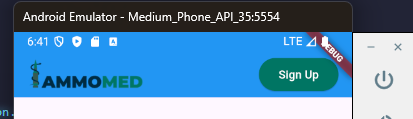
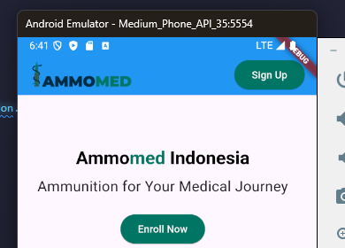
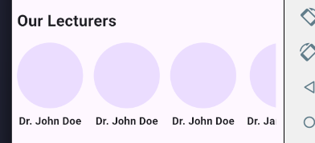

- Ini masih bisa berubah

# Mencoba Widget di Flutter

## Modifikasi main.dart

Pertama saya memorifikasi main.dert merubah menjadi seperti berikut:

```dart
import 'package:flutter/material.dart';
import 'package:helloworld/widgets/herosection.dart';

void main() {
  runApp(const MyApp());
}

class MyApp extends StatelessWidget {
  const MyApp({super.key});

  @override
  Widget build(BuildContext context) {
    return MaterialApp(
      title: 'Flutter Demo',
      theme: ThemeData(
        colorScheme: ColorScheme.fromSeed(seedColor: Colors.deepPurple),
        useMaterial3: true,
      ),
      home: const MyHomePage(),
    );
  }
}

class MyHomePage extends StatelessWidget {
  const MyHomePage({super.key});

  @override
  Widget build(BuildContext context) {
    return Scaffold(
      appBar: AppBar(
        title: Row(
          mainAxisAlignment: MainAxisAlignment.spaceBetween,
          children: [
            Image.network(
              'https://ammomed.com/_next/image?url=%2Flogo.png&w=256&q=75',
              height: 40,
            ),
            ElevatedButton(
              onPressed: () {
                print('Login button pressed');
              },
              style: ElevatedButton.styleFrom(
                foregroundColor: const Color.fromARGB(255, 253, 255, 255),
                backgroundColor: const Color.fromARGB(255, 12, 117, 100),
              ),
              child: const Text('Sign Up'),
            ),
          ],
        ),
        backgroundColor: Colors.blue,
      ),
      body: const HeroSection(),
    );
  }
}

```

# Penjelasan

### Import Package

Mengimpor `package:flutter/material.dart` dan `package:helloworld/widgets/herosection.dart`.

### Main Function

Fungsi `main` menjalankan aplikasi dengan `MyApp`.

### MyApp Class

- Merupakan `StatelessWidget`.
- Menggunakan `MaterialApp` dengan judul "Flutter Demo".
- Tema aplikasi menggunakan `ColorScheme` dengan warna dasar `Colors.deepPurple`.
- `home` diatur ke `MyHomePage`.

### MyHomePage Class

- Merupakan `StatelessWidget`.
- Menggunakan `Scaffold` untuk struktur dasar halaman.
- `AppBar` berisi logo dan tombol "Sign Up".
- `body` diatur ke `HeroSection`.

Dengan modifikasi ini, aplikasi Flutter menampilkan halaman dengan `AppBar` yang memiliki logo dan tombol "Sign Up", serta menampilkan konten dari widget `HeroSection`.



## Membuat HeroSection

Selanjutnya, saya membuat file `herosection.dart` di dalam folder `widgets` dengan kode berikut:

```dart
import 'package:flutter/material.dart';
import 'our_lecturers.dart';

class HeroSection extends StatelessWidget {
  const HeroSection({super.key});

  @override
  Widget build(BuildContext context) {
    return SizedBox(
      height: 500,
      width: 400,
      child: Column(
        mainAxisAlignment: MainAxisAlignment.center,
        children: [
          RichText(
            textAlign: TextAlign.center,
            text: const TextSpan(
              children: [
                TextSpan(
                  text: 'Ammo',
                  style: TextStyle(
                    fontSize: 25,
                    fontWeight: FontWeight.bold,
                    color: Colors.black,
                  ),
                ),
                TextSpan(
                  text: 'med',
                  style: TextStyle(
                    fontSize: 25,
                    fontWeight: FontWeight.bold,
                    color: Color.fromARGB(255, 12, 117, 100),
                  ),
                ),
                TextSpan(
                  text: ' Indonesia',
                  style: TextStyle(
                    fontSize: 25,
                    fontWeight: FontWeight.bold,
                    color: Colors.black,
                  ),
                ),
              ],
            ),
          ),
          const SizedBox(height: 10),
          const Text(
            'Ammunition for Your Medical Journey',
            style: TextStyle(
              fontSize: 20,
            ),
            textAlign: TextAlign.center,
          ),
          const SizedBox(height: 20),
          ElevatedButton(
            onPressed: () {
              print('Enroll Now button pressed');
            },
            style: ElevatedButton.styleFrom(
              backgroundColor: const Color.fromARGB(255, 12, 117, 100),
              foregroundColor: const Color.fromARGB(255, 253, 255, 255),
            ),
            child: const Text('Enroll Now'),
          ),
          const SizedBox(height: 20),
          const OurLecturers(),
        ],
      ),
    );
  }
}
```

### Penjelasan

#### Import Package

Mengimpor `package:flutter/material.dart` dan `our_lecturers.dart`.

#### HeroSection Class

- Merupakan `StatelessWidget`.
- Menggunakan `SizedBox` dengan tinggi 500 dan lebar 400 untuk mengatur ukuran widget.

#### RichText Widget

- Menampilkan teks "Ammo", "med", dan "Indonesia" dengan gaya yang berbeda.
- Teks "Ammo" dan "Indonesia" berwarna hitam, sedangkan "med" berwarna hijau.

#### Text Widget

- Menampilkan teks "Ammunition for Your Medical Journey" dengan ukuran font 20 dan rata tengah.

#### ElevatedButton Widget

- Tombol dengan teks "Enroll Now".
- Warna latar belakang hijau dan teks putih.
- Menampilkan pesan di konsol saat ditekan.

#### OurLecturers Widget

- Menampilkan daftar dosen dengan foto bulat dan nama di bawahnya.
- Diimpor dari file `our_lecturers.dart`.

Dengan kode ini, `HeroSection` menampilkan teks, tombol, dan daftar dosen dalam satu kolom yang terpusat.



## Membuat OurLecturers

Selanjutnya, saya membuat file `our_lecturers.dart` di dalam folder `widgets` dengan kode berikut:

```dart
import 'package:flutter/material.dart';

class OurLecturers extends StatelessWidget {
  const OurLecturers({super.key});

  @override
  Widget build(BuildContext context) {
    return SizedBox(
      height: 200,
      child: Column(
        crossAxisAlignment: CrossAxisAlignment.start,
        children: [
          const Padding(
            padding: EdgeInsets.all(8.0),
            child: Text(
              'Our Lecturers',
              style: TextStyle(
                fontSize: 24,
                fontWeight: FontWeight.bold,
              ),
            ),
          ),
          Expanded(
            child: ListView(
              scrollDirection: Axis.horizontal,
              children: const [
                LecturerCard(
                  imageUrl: 'https://via.placeholder.com/150',
                  name: 'Dr. John Doe',
                ),
                LecturerCard(
                  imageUrl: 'https://via.placeholder.com/150',
                  name: 'Dr. John Doe',
                ),
                LecturerCard(
                  imageUrl: 'https://via.placeholder.com/150',
                  name: 'Dr. John Doe',
                ),
                LecturerCard(
                  imageUrl: 'https://via.placeholder.com/150',
                  name: 'Dr. Jane Smith',
                ),
                LecturerCard(
                  imageUrl: 'https://via.placeholder.com/150',
                  name: 'Dr. Emily Johnson',
                ),
              ],
            ),
          ),
        ],
      ),
    );
  }
}

class LecturerCard extends StatelessWidget {
  final String imageUrl;
  final String name;

  const LecturerCard({
    required this.imageUrl,
    required this.name,
    super.key,
  });

  @override
  Widget build(BuildContext context) {
    return Padding(
      padding: const EdgeInsets.all(8.0),
      child: Column(
        children: [
          CircleAvatar(
            radius: 50,
            backgroundImage: NetworkImage(imageUrl),
          ),
          const SizedBox(height: 8),
          Text(
            name,
            style: const TextStyle(
              fontSize: 16,
              fontWeight: FontWeight.bold,
            ),
          ),
        ],
      ),
    );
  }
}

```

## Penjelasan

### OurLecturers Class

- Merupakan `StatelessWidget`.
- Menggunakan `SizedBox` dengan tinggi 200 untuk mengatur ukuran widget.
- Menampilkan judul "Our Lecturers" dengan gaya teks yang tebal dan ukuran font 24.
- Menggunakan `ListView` dengan scroll horizontal untuk menampilkan daftar dosen.

### LecturerCard Class

- Merupakan `StatelessWidget`.
- Menerima dua parameter: `imageUrl` dan `name`.
- Menggunakan `CircleAvatar` untuk menampilkan foto dosen dalam bentuk bulat dengan radius 50.
- Menampilkan nama dosen di bawah foto dengan gaya teks yang tebal dan ukuran font 16.

Dengan kode ini, `OurLecturers` menampilkan daftar dosen dengan foto bulat dan nama di bawahnya dalam satu baris yang dapat digulir secara horizontal.



<video controls src="image/record.mp4" title="Title"></video>

# Terdapat Error pada SDK tapi masih bisa dijalankan👍😁


