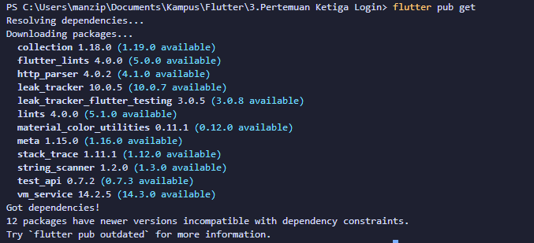
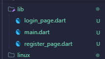
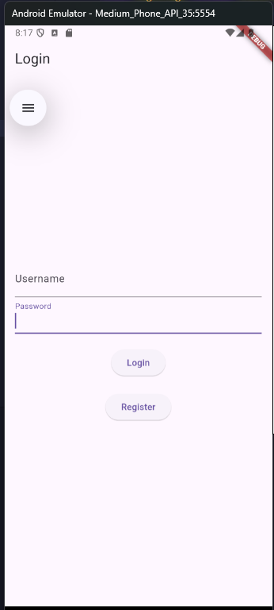
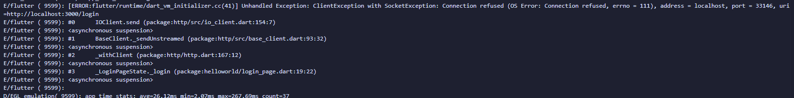
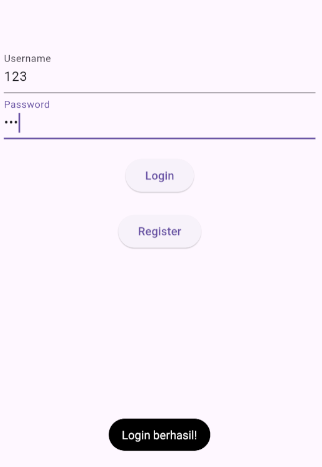

html> Panduan Flutter dan Node.js

# Panduan Membuat Aplikasi Flutter dengan Login dan Register

## 1\. Instalasi Dependensi HTTP pada Flutter

1.  Buka terminal di direktori proyek Flutter Anda.
2.  Jalankan perintah berikut untuk menambahkan paket http:

        flutter pub add http

3.  Tunggu hingga proses selesai. Flutter akan menambahkan dependensi http ke file `pubspec.yaml` Anda.



## 2\. Tutorial Flutter Membuat Login dan Register

### Langkah 1: Struktur Proyek

1.  Buat folder baru bernama `lib/screens`.
2.  Di dalam folder `screens`, buat dua file baru:
    - `login_page.dart`
    - `register_page.dart`



### Langkah 2: Membuat Halaman Login (`login_page.dart`)

Buka file `login_page.dart` dan tambahkan kode berikut:

    import 'package:flutter/material.dart';
    import 'package:http/http.dart' as http;
    import 'dart:convert';
    import 'register_page.dart';

    class LoginPage extends StatefulWidget {
      const LoginPage({Key? key}) : super(key: key);

      @override
      _LoginPageState createState() => _LoginPageState();
    }

    class _LoginPageState extends State {
      final TextEditingController _usernameController = TextEditingController();
      final TextEditingController _passwordController = TextEditingController();
      String _message = '';

      // Fungsi untuk melakukan login
      Future _login() async {
        final response = await http.post(
          Uri.parse('http:/localhost:3000/login'),
          headers: {
            'Content-Type': 'application/json; charset=UTF-8',
          },
          body: jsonEncode({
            'username': _usernameController.text,
            'password': _passwordController.text,
          }),
        );

        if (response.statusCode == 200) {
          setState(() {
            _message = 'Login berhasil!';
          });
          // Tambahkan navigasi ke halaman utama di sini
        } else {
          setState(() {
            _message = 'Login gagal. Periksa kembali username dan password Anda.';
          });
        }
      }

      @override
      Widget build(BuildContext context) {
        return Scaffold(
          appBar: AppBar(title: const Text('Login')),
          body: Padding(
            padding: const EdgeInsets.all(16.0),
            child: Column(
              mainAxisAlignment: MainAxisAlignment.center,
              children: [
                TextField(
                  controller: _usernameController,
                  decoration: const InputDecoration(labelText: 'Username'),
                ),
                TextField(
                  controller: _passwordController,
                  decoration: const InputDecoration(labelText: 'Password'),
                  obscureText: true,
                ),
                const SizedBox(height: 20),
                ElevatedButton(
                  onPressed: _login,
                  child: const Text('Login'),
                ),
                const SizedBox(height: 20),
                ElevatedButton(
                  onPressed: () {
                    Navigator.push(
                      context,
                      MaterialPageRoute(builder: (context) => const RegisterPage()),
                    );
                  },
                  child: const Text('Register'),
                ),
                const SizedBox(height: 20),
                Text(_message),
              ],
            ),
          ),
        );
      }
    }



Nah di sini saya mendapatkan error ketika saya tes ke api dengan login

```text
username: 123
password: 123
```



Akhirnya saya menemukan solusinya dari sini [Stackoverflow](https://stackoverflow.com/questions/55785581/socketexception-os-error-connection-refused-errno-111-in-flutter-using-djan)

kurang lebih seperti ini
Kan ini menggunakan emulator, nah kondisinya emulator adalah device yang berbeda dengan device yang menjalankan server, jadi kita harus menggunakan ip dari device yang menjalankan server.

```dart
final response = await http.post(
      Uri.parse('http://192.168.0.105:3000/login'),
      headers: <String, String>{
        'Content-Type': 'application/json; charset=UTF-8',
      },
      body: jsonEncode(<String, String>{
        'username': _usernameController.text,
        'password': _passwordController.text,
      }),
    );
```

### Langkah 3: Membuat Halaman Register (`register_page.dart`)

Buka file `register_page.dart` dan tambahkan kode berikut:

    import 'package:flutter/material.dart';
    import 'package:http/http.dart' as http;
    import 'dart:convert';

    class RegisterPage extends StatefulWidget {
      const RegisterPage({Key? key}) : super(key: key);

      @override
      _RegisterPageState createState() => _RegisterPageState();
    }

    class _RegisterPageState extends State {
      final TextEditingController _usernameController = TextEditingController();
      final TextEditingController _passwordController = TextEditingController();
      String _message = '';

      // Fungsi untuk melakukan registrasi
      Future _register() async {
        final response = await http.post(
          Uri.parse('http://localhost:3000/register'),
          headers: {
            'Content-Type': 'application/json; charset=UTF-8',
          },
          body: jsonEncode({
            'username': _usernameController.text,
            'password': _passwordController.text,
          }),
        );

        if (response.statusCode == 201) {
          setState(() {
            _message = 'Registrasi berhasil!';
          });
        } else {
          setState(() {
            _message = 'Registrasi gagal. Coba lagi.';
          });
        }
      }

      @override
      Widget build(BuildContext context) {
        return Scaffold(
          appBar: AppBar(title: const Text('Register')),
          body: Padding(
            padding: const EdgeInsets.all(16.0),
            child: Column(
              mainAxisAlignment: MainAxisAlignment.center,
              children: [
                TextField(
                  controller: _usernameController,
                  decoration: const InputDecoration(labelText: 'Username'),
                ),
                TextField(
                  controller: _passwordController,
                  decoration: const InputDecoration(labelText: 'Password'),
                  obscureText: true,
                ),
                const SizedBox(height: 20),
                ElevatedButton(
                  onPressed: _register,
                  child: const Text('Register'),
                ),
                const SizedBox(height: 20),
                Text(_message),
              ],
            ),
          ),
        );
      }
    }

### Langkah 4: Mengupdate `main.dart`

Buka file `main.dart` dan update dengan kode berikut:

    import 'package:flutter/material.dart';
    import 'screens/login_page.dart';

    void main() {
      runApp(const MyApp());
    }

    class MyApp extends StatelessWidget {
      const MyApp({Key? key}) : super(key: key);

      @override
      Widget build(BuildContext context) {
        return MaterialApp(
          title: 'Flutter Login Register Demo',
          theme: ThemeData(
            primarySwatch: Colors.blue,
          ),
          home: const LoginPage(),
        );
      }
    }

## 3\. Penjelasan Kode Node.js

Berikut adalah penjelasan untuk kode Node.js yang Anda berikan sebelumnya:

    const express = require("express");
    const bodyParser = require("body-parser");
    const jwt = require("jsonwebtoken");

    const app = express();
    const PORT = 3000;

    // Middleware untuk parsing JSON bodies
    app.use(bodyParser.json());

    // Penyimpanan pengguna dalam memori (untuk demonstrasi)
    const users = [];
    const SECRET_KEY = "your_secret_key"; // Ganti dengan kunci rahasia yang kuat

    // Endpoint registrasi
    app.post("/register", (req, res) => {
      const { username, password } = req.body;

      // Memeriksa apakah pengguna sudah ada
      const existingUser = users.find((user) => user.username === username);
      if (existingUser) {
        return res.status(400).json({ message: "User already exists!" });
      }

      // Mendaftarkan pengguna baru
      users.push({ username, password });
      return res.status(201).json({ message: "User registered successfully!" });
    });

    // Endpoint login
    app.post("/login", (req, res) => {
      const { username, password } = req.body;

      const user = users.find(
        (user) => user.username === username && user.password === password
      );
      if (user) {
        // Membuat token
        const token = jwt.sign({ username }, SECRET_KEY, { expiresIn: "1h" });
        return res.status(200).json({ message: "Login successful!", token });
      } else {
        return res.status(401).json({ message: "Invalid credentials!" });
      }
    });

    // Middleware untuk verifikasi token
    const verifyToken = (req, res, next) => {
      const token = req.headers["authorization"];

      if (!token) {
        return res.sendStatus(403);
      }

      jwt.verify(token, SECRET_KEY, (err, decoded) => {
        if (err) {
          return res.sendStatus(403);
        }
        req.user = decoded;
        next();
      });
    };

    // Contoh rute yang dilindungi
    app.get("/protected", verifyToken, (req, res) => {
      res.json({ message: "This is a protected route!", user: req.user });
    });

    // Memulai server
    app.listen(PORT, () => {
      console.log(`Server is running on http://localhost:${PORT}`);
    });

Kode ini membuat server Express.js sederhana dengan fitur registrasi, login, dan rute yang dilindungi menggunakan JWT (JSON Web Tokens). Berikut adalah penjelasan lebih detail:

1.  Mengimpor dependensi yang diperlukan: express, body-parser, dan jsonwebtoken.
2.  Membuat aplikasi Express dan mengatur port.
3.  Menggunakan middleware body-parser untuk parsing body JSON.
4.  Menyimpan pengguna dalam array (untuk demonstrasi; dalam produksi, gunakan database).
5.  Mendefinisikan `SECRET_KEY` untuk menandatangani dan memverifikasi token JWT.
6.  Membuat endpoint `/register` untuk mendaftarkan pengguna baru.
7.  Membuat endpoint `/login` untuk autentikasi pengguna dan mengeluarkan token JWT.
8.  Membuat middleware `verifyToken` untuk memverifikasi token JWT pada rute yang dilindungi.
9.  Membuat contoh rute yang dilindungi `/protected` yang memerlukan token valid untuk diakses.
10. Memulai server pada port yang ditentukan.

## 4\. Menambahkan Fitur fluttertoast

Saya ingin menambahkan fitur `fluttertoast` ke aplikasi Flutter saya. Bagaimana cara melakukannya?

### Langkah 1: Instalasi Paket `fluttertoast`

```text
dependencies:
  flutter:
    sdk: flutter
  http: ^0.13.5
  fluttertoast: ^8.0.9  #tambahkan ini
```

### Langkah 2: Jalankan `flutter pub get`

```bash
flutter pub get
```

### Langkah 3: Menggunakan `fluttertoast` di Aplikasi Anda

Anda dapat menggunakan `fluttertoast` pada login_page.dart dan register_page.dart

login_page.dart:

```dart
import 'package:fluttertoast/fluttertoast.dart';

if (response.statusCode == 200) {
      Fluttertoast.showToast(
        msg: "Login berhasil!",
        toastLength: Toast.LENGTH_SHORT,
        gravity: ToastGravity.BOTTOM,
      );
      // Tambahkan navigasi ke halaman utama di sini
    } else {
      Fluttertoast.showToast(
        msg: "Login gagal. Periksa kembali username dan password Anda.",
        toastLength: Toast.LENGTH_SHORT,
        gravity: ToastGravity.BOTTOM,
      );
    }
```

register_page.dart:

```dart
import 'package:fluttertoast/fluttertoast.dart';

 if (response.statusCode == 201) {
      Fluttertoast.showToast(
        msg: "Registrasi berhasil!",
        toastLength: Toast.LENGTH_SHORT,
        gravity: ToastGravity.BOTTOM,
      );
    } else {
      Fluttertoast.showToast(
        msg: "Registrasi gagal. Coba lagi.",
        toastLength: Toast.LENGTH_SHORT,
        gravity: ToastGravity.BOTTOM,
      );
    }

```

Dan selesai!


