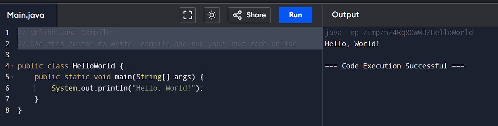
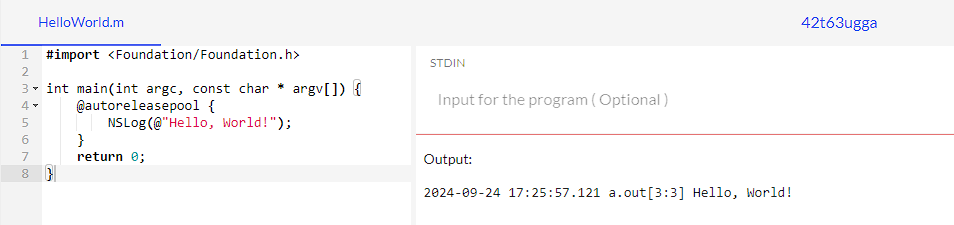
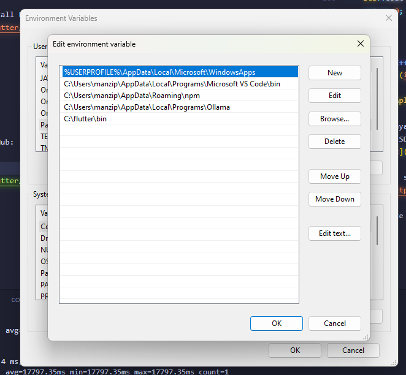

# Layanan Mobile & Web di Kelas IV

## Pengertian Mobile

Mobile adalah perangkat elektronik yang bisa dibawa ke mana-mana dan dipakai untuk berkomunikasi atau menjalankan berbagai aplikasi. Contoh perangkat mobile termasuk smartphone, tablet, dan smartwatch.

### Smartphone

Smartphone adalah perangkat mobile yang bisa menjalankan banyak aplikasi dan digunakan untuk berbagai kebutuhan sehari-hari. Smartphone punya beberapa jenis sistem operasi, seperti:

- **Android**: Dikembangkan oleh Google, digunakan oleh banyak merek ponsel.
- **iOS**: Dikembangkan oleh Apple dan hanya digunakan pada iPhone.
- **Windows Phone**: Dikembangkan oleh Microsoft, tapi sekarang sudah tidak lagi dikembangkan.

## Pengertian Web Services

Web Services adalah sebuah API yang memungkinkan aplikasi-aplikasi di platform yang berbeda untuk saling terhubung dan berkomunikasi.

## Bahasa Pemrograman

### Platform Web

- **PHP**: Bahasa pemrograman server-side yang sangat populer untuk membuat website. PHP bisa berjalan di server seperti Apache dan Nginx.
- **Java**: Digunakan untuk membangun aplikasi web, terutama di platform J2EE, yang menyediakan alat dan lingkungan untuk menjalankan aplikasi bisnis besar.
- **JavaScript**: Awalnya dibuat untuk web client-side, tapi dengan Node.js, JavaScript sekarang bisa dipakai juga untuk server-side.
- **ASP.NET**: Framework dari Microsoft untuk membuat website yang dinamis, berjalan di atas server IIS (Internet Information Services).
- **Python**: Bahasa pemrograman serbaguna yang punya framework web populer seperti Django dan Flask.

### Platform Mobile

- **Android (Java)**: Java digunakan di platform J2EE untuk mengembangkan aplikasi Android.
- **Kotlin**: Bahasa modern yang dirancang untuk Android, dapat berjalan di atas JVM (Java Virtual Machine), dan bisa bekerja bersama dengan Java.
- **iOS (Swift)**: Bahasa yang dikembangkan oleh Apple untuk membuat aplikasi iOS, macOS, dan lainnya. Lebih cepat dan mudah dipelajari dibandingkan Objective-C.
- **Objective-C**: Bahasa yang dulu dipakai untuk membuat aplikasi iOS sebelum adanya Swift. Objective-C berbasis C dengan sintaks mirip Smalltalk.

### Platform Desktop

- **Delphi**: Bahasa pemrograman yang sering dipakai untuk membuat aplikasi desktop dengan bantuan IDE yang memudahkan pengembangan.
- **Java**: Selain untuk web, Java juga dipakai untuk aplikasi desktop melalui JavaFX, teknologi yang memudahkan pembuatan aplikasi dengan tampilan grafis.
- **Electron.js**: Framework yang memungkinkan pengembangan aplikasi desktop menggunakan HTML, CSS, dan JavaScript, bisa dijalankan di berbagai sistem operasi seperti Windows, macOS, dan Linux.

### Platform IoT (Embedded)

- **Arduino**: Platform open-source yang dipakai untuk membuat prototipe perangkat elektronik, menggunakan bahasa pemrograman C++.

## Database

# RDBMS (Relational Database Management System)

- **MySQL**: Database open-source yang paling populer di dunia, banyak digunakan untuk aplikasi web.
- **PostgreSQL**: Database open-source yang kuat dan handal, cocok untuk aplikasi yang membutuhkan keamanan dan konsistensi data.
- **SQLite**: Database ringan yang bisa dijalankan di berbagai platform, sering dipakai untuk aplikasi mobile.
- **Oracle**: Database yang kuat dan handal, banyak digunakan di perusahaan-perusahaan besar.
- **SQL Server**: Database dari Microsoft yang punya integrasi yang baik dengan platform Windows.

# NoSql (Not Only SQL)

- **MongoDB**: Database NoSQL yang berbasis dokumen, cocok untuk aplikasi yang membutuhkan fleksibilitas dan skalabilitas.
- **GraphQL**: Query language yang memungkinkan aplikasi client untuk meminta data dengan format yang diinginkan, sangat cocok untuk aplikasi mobile dan web.
- **Firebase**: Platform dari Google yang menyediakan berbagai layanan, seperti database, autentikasi, dan analitik, untuk aplikasi mobile dan web.

## Code Sederhana Menampilkan Hello World

# PHP

```php
<?php
echo "Hello, World!";
?>
```

[PHP Online Compiler](https://www.programiz.com/online-compiler/1YucYCc8eteno)


Menggunakan program php sangat mudah, hanya dengan menggunakan `<?php` dan `?>` kita bisa menampilkan Hello World.

# Java

```java
public class HelloWorld {
    public static void main(String[] args) {
        System.out.println("Hello, World!");
    }
}
```

[Programiz Java Online Compiler](https://www.programiz.com/online-compiler/3ODeOwBCIKdp2)


Program Java menurut saya cukup sulit, karena harus menggunakan class dan method dan harus mendeklarasikan class terlebih dahulu.

# JavaScript

```javascript
console.log("Hello, World!");
```

[Programiz JavaScript Online Compiler](https://www.programiz.com/online-compiler/8lOJlN4Y5XWWU)


JavaScript sangat mudah karna saya sudah terbiasa menggunakan JavaScript, hanya dengan menggunakan `console.log` kita bisa menampilkan Hello World.

# ASP.NET

```csharp
using System;

namespace HelloWorld
{
    class Program
    {
        static void Main(string[] args)
        {
            Console.WriteLine("Hello, World!");
        }
    }
}
```

[OneCompiler C# Online Compiler](https://onecompiler.com/csharp/42t645x2c)


Program ASP.NET menurut saya cukup sulit, seperti Java, kita harus mendeklarasikan class terlebih dahulu dan menggunakan method untuk menampilkan Hello World.

# Python

```python
print("Hello, World!")
```

[Programiz Python Online Compiler](https://www.programiz.com/online-compiler/1K08KT8SG1dx2)


Python sangat mudah, hanya dengan menggunakan `print` kita bisa menampilkan Hello World.

# Kotlin

```kotlin
fun main() {
    println("Hello, World!")
}
```

[Kotlin Online Compiler](https://www.programiz.com/online-compiler/5EG5EuofWk8aI)


Kotlin menurut saya cukup mudah, hanya dengan menggunakan `fun` dan `println` kita bisa menampilkan Hello World.

# Swift

```swift
print("Hello, World!")
```

[Programiz Swift Online Compiler](https://www.programiz.com/online-compiler/5EG5EuofWk8aI)


Seperti python dan javascript, Swift sangat mudah, hanya dengan menggunakan `print` kita bisa menampilkan Hello World, lebih mirip dengan Python.

# Objective-C

```objective-c
#import <Foundation/Foundation.h>

int main(int argc, const char * argv[]) {
    @autoreleasepool {
        NSLog(@"Hello, World!");
    }
    return 0;
}
```

code tutorial dari : https://www.digitalocean.com/community/tutorials/objective-c-hello-world-tutorial

[Code Tutorial](https://www.digitalocean.com/community/tutorials/objective-c-hello-world-tutorial)

Di beberapa compiler error tapi di online compiler ini bisa:
[OneCompiler Objective-C Online Compiler](https://onecompiler.com/objectivec/42t63ugga)


Objective-C menurut saya cukup sulit, saya masih belum terlalu paham dengan Objective-C, tapi saya sudah mencoba membuat Hello World dengan Objective-C.

# Delphi

```delphi
program HelloWorld;

begin
  WriteLn('Hello, World!');
end.
```

[OneCompiler Delphi Online Compiler](https://onecompiler.com/pascal/42t64xa7c)


Bahasa Delphi menurut saya cukup sulit karna belum pernah saya melihat code yang di tulis seperti ini, tapi saya sudah mencoba membuat Hello World dengan Delphi.

# C++

```cpp
#include <iostream>

int main() {
    std::cout << "Hello, World!" << std::endl;
    return 0;
}
```

[programiz C++ Online Compiler](https://www.programiz.com/online-compiler/7K0DRRnBh16Jz)


C++ menurut saya mudah mudah sulit, karna saya sudah pernah menggunakan C++ untuk Arduino, tapi saya masih belum terlalu paham dengan C++.

## Membuat Aplikasi Mobile Dengan Flutter

Berhubung saya sudah menginstall Android Studio pada laptop saya, maka selanjutnya saya akan menginstall SDK tools pada Android Studio.


Setelah itu, saya perlu menginstall Flutter. Saya mengambil dari GitHub:
[Flutter](https://github.com/flutter/flutter)

Lalu masuk ke disk C:

```sh
cd c:
cd \
```

Kemudian clone Flutter dari GitHub:

```sh
git clone https://github.com/flutter/flutter.git -b stable
```

Setelah itu, saya perlu menambahkan path Flutter ke Environment Variables. Saya masuk ke Control Panel > System and Security > System > Advanced System Settings > Environment Variables. Lalu saya tambahkan path Flutter ke System Variables.


Lalu saya buka Command Prompt dan ketikkan:

```sh
flutter doctor --android-licenses
```

Dan saya setujui semua lisensi yang muncul.

Setelah itu, saya coba jalankan Flutter:

```sh
flutter doctor
```


## Setelah semua selesai, saya coba buat aplikasi Flutter sederhana

```sh
flutter create helloworld
```


Kemudian saya buka aplikasi Flutter yang sudah saya buat di Visual Studio Code.

```sh
cd helloworld
code .
```

Lalu saya edit file `main.dart` di folder `lib/main.dart` dari:

```dart
home: const MyHomePage(title: 'Flutter Demo Home Page'),
```

Menjadi:

```dart
home: const MyHomePage(title: 'Hello World'),
```

Berhubug saya tidak ingin merubah banyak hal terlebih dahulu, maka saya menambahkan 'Hello World' saja:

```dart
 children: <Widget>[
            const Text("Hello World"),
            const Text(
              'You have pushed the button this many times:',
            ),
            Text(
              '$_counter',
              style: Theme.of(context).textTheme.headlineMedium,
            ),
          ],
```

Kemudian saya menjalankan android emulator malalui vscode

lalu saya jalankan aplikasi Flutter yang sudah saya buat dengan menggunakan perintah:

```sh
flutter run
```

Dan ini adalah hasilnya:


