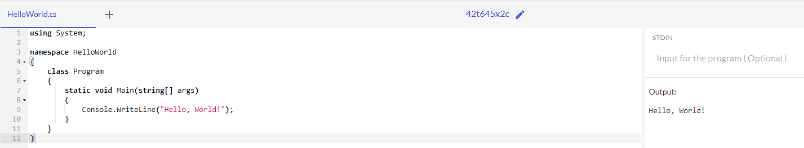
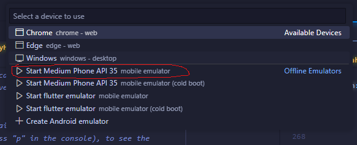

# Semua Laporan

Ini adalah gabungan dari laporan pertemuan 1, 2, 3, dan 4.

- [Pertemuan 1](#pertemuan-1)
- [Pertemuan 2](#pertemuan-2)
- [Pertemuan 3](#pertemuan-3)
- [Pertemuan 4](#pertemuan-4)
- [Pertemuan 5](#pertemuan-5)
- [Pertemuan 6](#pertemuan-6)

# Pertemuan 1

# Layanan Mobile & Web di Kelas IV

## Pengertian Mobile

Mobile adalah perangkat elektronik yang bisa dibawa ke mana-mana dan dipakai untuk berkomunikasi atau menjalankan berbagai aplikasi. Contoh perangkat mobile termasuk smartphone, tablet, dan smartwatch.

### Smartphone

Smartphone adalah perangkat mobile yang bisa menjalankan banyak aplikasi dan digunakan untuk berbagai kebutuhan sehari-hari. Smartphone punya beberapa jenis sistem operasi, seperti:

- **Android**: Dikembangkan oleh Google, digunakan oleh banyak merek ponsel.
- **iOS**: Dikembangkan oleh Apple dan hanya digunakan pada iPhone.
- **Windows Phone**: Dikembangkan oleh Microsoft, tapi sekarang sudah tidak lagi dikembangkan.

## Pengertian Web Services

Web Services adalah sebuah API yang memungkinkan aplikasi-aplikasi di platform yang berbeda untuk saling terhubung dan berkomunikasi.

## Bahasa Pemrograman

### Platform Web

- **PHP**: Bahasa pemrograman server-side yang sangat populer untuk membuat website. PHP bisa berjalan di server seperti Apache dan Nginx.
- **Java**: Digunakan untuk membangun aplikasi web, terutama di platform J2EE, yang menyediakan alat dan lingkungan untuk menjalankan aplikasi bisnis besar.
- **JavaScript**: Awalnya dibuat untuk web client-side, tapi dengan Node.js, JavaScript sekarang bisa dipakai juga untuk server-side.
- **ASP.NET**: Framework dari Microsoft untuk membuat website yang dinamis, berjalan di atas server IIS (Internet Information Services).
- **Python**: Bahasa pemrograman serbaguna yang punya framework web populer seperti Django dan Flask.

### Platform Mobile

- **Android (Java)**: Java digunakan di platform J2EE untuk mengembangkan aplikasi Android.
- **Kotlin**: Bahasa modern yang dirancang untuk Android, dapat berjalan di atas JVM (Java Virtual Machine), dan bisa bekerja bersama dengan Java.
- **iOS (Swift)**: Bahasa yang dikembangkan oleh Apple untuk membuat aplikasi iOS, macOS, dan lainnya. Lebih cepat dan mudah dipelajari dibandingkan Objective-C.
- **Objective-C**: Bahasa yang dulu dipakai untuk membuat aplikasi iOS sebelum adanya Swift. Objective-C berbasis C dengan sintaks mirip Smalltalk.

### Platform Desktop

- **Delphi**: Bahasa pemrograman yang sering dipakai untuk membuat aplikasi desktop dengan bantuan IDE yang memudahkan pengembangan.
- **Java**: Selain untuk web, Java juga dipakai untuk aplikasi desktop melalui JavaFX, teknologi yang memudahkan pembuatan aplikasi dengan tampilan grafis.
- **Electron.js**: Framework yang memungkinkan pengembangan aplikasi desktop menggunakan HTML, CSS, dan JavaScript, bisa dijalankan di berbagai sistem operasi seperti Windows, macOS, dan Linux.

### Platform IoT (Embedded)

- **Arduino**: Platform open-source yang dipakai untuk membuat prototipe perangkat elektronik, menggunakan bahasa pemrograman C++.

## Database

# RDBMS (Relational Database Management System)

- **MySQL**: Database open-source yang paling populer di dunia, banyak digunakan untuk aplikasi web.
- **PostgreSQL**: Database open-source yang kuat dan handal, cocok untuk aplikasi yang membutuhkan keamanan dan konsistensi data.
- **SQLite**: Database ringan yang bisa dijalankan di berbagai platform, sering dipakai untuk aplikasi mobile.
- **Oracle**: Database yang kuat dan handal, banyak digunakan di perusahaan-perusahaan besar.
- **SQL Server**: Database dari Microsoft yang punya integrasi yang baik dengan platform Windows.

# NoSql (Not Only SQL)

- **MongoDB**: Database NoSQL yang berbasis dokumen, cocok untuk aplikasi yang membutuhkan fleksibilitas dan skalabilitas.
- **GraphQL**: Query language yang memungkinkan aplikasi client untuk meminta data dengan format yang diinginkan, sangat cocok untuk aplikasi mobile dan web.
- **Firebase**: Platform dari Google yang menyediakan berbagai layanan, seperti database, autentikasi, dan analitik, untuk aplikasi mobile dan web.

## Code Sederhana Menampilkan Hello World

# PHP

```php
<?php
echo "Hello, World!";
?>
```

[PHP Online Compiler](https://www.programiz.com/online-compiler/1YucYCc8eteno)


Menggunakan program php sangat mudah, hanya dengan menggunakan `<?php` dan `?>` kita bisa menampilkan Hello World.

# Java

```java
public class HelloWorld {
    public static void main(String[] args) {
        System.out.println("Hello, World!");
    }
}
```

[Programiz Java Online Compiler](https://www.programiz.com/online-compiler/3ODeOwBCIKdp2)


Program Java menurut saya cukup sulit, karena harus menggunakan class dan method dan harus mendeklarasikan class terlebih dahulu.

# JavaScript

```javascript
console.log("Hello, World!");
```

[Programiz JavaScript Online Compiler](https://www.programiz.com/online-compiler/8lOJlN4Y5XWWU)


JavaScript sangat mudah karna saya sudah terbiasa menggunakan JavaScript, hanya dengan menggunakan `console.log` kita bisa menampilkan Hello World.

# ASP.NET

```csharp
using System;

namespace HelloWorld
{
    class Program
    {
        static void Main(string[] args)
        {
            Console.WriteLine("Hello, World!");
        }
    }
}
```

[OneCompiler C# Online Compiler](https://onecompiler.com/csharp/42t645x2c)


Program ASP.NET menurut saya cukup sulit, seperti Java, kita harus mendeklarasikan class terlebih dahulu dan menggunakan method untuk menampilkan Hello World.

# Python

```python
print("Hello, World!")
```

[Programiz Python Online Compiler](https://www.programiz.com/online-compiler/1K08KT8SG1dx2)


Python sangat mudah, hanya dengan menggunakan `print` kita bisa menampilkan Hello World.

# Kotlin

```kotlin
fun main() {
    println("Hello, World!")
}
```

[Kotlin Online Compiler](https://www.programiz.com/online-compiler/5EG5EuofWk8aI)


Kotlin menurut saya cukup mudah, hanya dengan menggunakan `fun` dan `println` kita bisa menampilkan Hello World.

# Swift

```swift
print("Hello, World!")
```

[Programiz Swift Online Compiler](https://www.programiz.com/online-compiler/5EG5EuofWk8aI)


Seperti python dan javascript, Swift sangat mudah, hanya dengan menggunakan `print` kita bisa menampilkan Hello World, lebih mirip dengan Python.

# Objective-C

```objective-c
#import <Foundation/Foundation.h>

int main(int argc, const char * argv[]) {
    @autoreleasepool {
        NSLog(@"Hello, World!");
    }
    return 0;
}
```

code tutorial dari : https://www.digitalocean.com/community/tutorials/objective-c-hello-world-tutorial

[Code Tutorial](https://www.digitalocean.com/community/tutorials/objective-c-hello-world-tutorial)

Di beberapa compiler error tapi di online compiler ini bisa:
[OneCompiler Objective-C Online Compiler](https://onecompiler.com/objectivec/42t63ugga)


Objective-C menurut saya cukup sulit, saya masih belum terlalu paham dengan Objective-C, tapi saya sudah mencoba membuat Hello World dengan Objective-C.

# Delphi

```delphi
program HelloWorld;

begin
  WriteLn('Hello, World!');
end.
```

[OneCompiler Delphi Online Compiler](https://onecompiler.com/pascal/42t64xa7c)


Bahasa Delphi menurut saya cukup sulit karna belum pernah saya melihat code yang di tulis seperti ini, tapi saya sudah mencoba membuat Hello World dengan Delphi.

# C++

```cpp
#include <iostream>

int main() {
    std::cout << "Hello, World!" << std::endl;
    return 0;
}
```

[programiz C++ Online Compiler](https://www.programiz.com/online-compiler/7K0DRRnBh16Jz)


C++ menurut saya mudah mudah sulit, karna saya sudah pernah menggunakan C++ untuk Arduino, tapi saya masih belum terlalu paham dengan C++.

## Membuat Aplikasi Mobile Dengan Flutter

Berhubung saya sudah menginstall Android Studio pada laptop saya, maka selanjutnya saya akan menginstall SDK tools pada Android Studio.


Setelah itu, saya perlu menginstall Flutter. Saya mengambil dari GitHub:
[Flutter](https://github.com/flutter/flutter)

Lalu masuk ke disk C:

```sh
cd c:
cd \
```

Kemudian clone Flutter dari GitHub:

```sh
git clone https://github.com/flutter/flutter.git -b stable
```

Setelah itu, saya perlu menambahkan path Flutter ke Environment Variables. Saya masuk ke Control Panel > System and Security > System > Advanced System Settings > Environment Variables. Lalu saya tambahkan path Flutter ke System Variables.


Lalu saya buka Command Prompt dan ketikkan:

```sh
flutter doctor --android-licenses
```

Dan saya setujui semua lisensi yang muncul.

Setelah itu, saya coba jalankan Flutter:

```sh
flutter doctor
```


## Setelah semua selesai, saya coba buat aplikasi Flutter sederhana

```sh
flutter create helloworld
```


Kemudian saya buka aplikasi Flutter yang sudah saya buat di Visual Studio Code.

```sh
cd helloworld
code .
```

Lalu saya edit file `main.dart` di folder `lib/main.dart` dari:

```dart
home: const MyHomePage(title: 'Flutter Demo Home Page'),
```

Menjadi:

```dart
home: const MyHomePage(title: 'Hello World'),
```

Berhubug saya tidak ingin merubah banyak hal terlebih dahulu, maka saya menambahkan 'Hello World' saja:

```dart
 children: <Widget>[
            const Text("Hello World"),
            const Text(
              'You have pushed the button this many times:',
            ),
            Text(
              '$_counter',
              style: Theme.of(context).textTheme.headlineMedium,
            ),
          ],
```

Kemudian saya menjalankan android emulator malalui vscode

lalu saya jalankan aplikasi Flutter yang sudah saya buat dengan menggunakan perintah:

```sh
flutter run
```

Dan ini adalah hasilnya:


# Pertemuan 2

- Ini masih bisa berubah

# Mencoba Widget di Flutter

## Modifikasi main.dart

Pertama saya memorifikasi main.dert merubah menjadi seperti berikut:

```dart
import 'package:flutter/material.dart';
import 'package:helloworld/widgets/herosection.dart';

void main() {
  runApp(const MyApp());
}

class MyApp extends StatelessWidget {
  const MyApp({super.key});

  @override
  Widget build(BuildContext context) {
    return MaterialApp(
      title: 'Flutter Demo',
      theme: ThemeData(
        colorScheme: ColorScheme.fromSeed(seedColor: Colors.deepPurple),
        useMaterial3: true,
      ),
      home: const MyHomePage(),
    );
  }
}

class MyHomePage extends StatelessWidget {
  const MyHomePage({super.key});

  @override
  Widget build(BuildContext context) {
    return Scaffold(
      appBar: AppBar(
        title: Row(
          mainAxisAlignment: MainAxisAlignment.spaceBetween,
          children: [
            Image.network(
              'https://ammomed.com/_next/image?url=%2Flogo.png&w=256&q=75',
              height: 40,
            ),
            ElevatedButton(
              onPressed: () {
                print('Login button pressed');
              },
              style: ElevatedButton.styleFrom(
                foregroundColor: const Color.fromARGB(255, 253, 255, 255),
                backgroundColor: const Color.fromARGB(255, 12, 117, 100),
              ),
              child: const Text('Sign Up'),
            ),
          ],
        ),
        backgroundColor: Colors.blue,
      ),
      body: const HeroSection(),
    );
  }
}

```

# Penjelasan

### Import Package

Mengimpor `package:flutter/material.dart` dan `package:helloworld/widgets/herosection.dart`.

### Main Function

Fungsi `main` menjalankan aplikasi dengan `MyApp`.

### MyApp Class

- Merupakan `StatelessWidget`.
- Menggunakan `MaterialApp` dengan judul "Flutter Demo".
- Tema aplikasi menggunakan `ColorScheme` dengan warna dasar `Colors.deepPurple`.
- `home` diatur ke `MyHomePage`.

### MyHomePage Class

- Merupakan `StatelessWidget`.
- Menggunakan `Scaffold` untuk struktur dasar halaman.
- `AppBar` berisi logo dan tombol "Sign Up".
- `body` diatur ke `HeroSection`.

Dengan modifikasi ini, aplikasi Flutter menampilkan halaman dengan `AppBar` yang memiliki logo dan tombol "Sign Up", serta menampilkan konten dari widget `HeroSection`.


## Membuat HeroSection

Selanjutnya, saya membuat file `herosection.dart` di dalam folder `widgets` dengan kode berikut:

```dart
import 'package:flutter/material.dart';
import 'our_lecturers.dart';

class HeroSection extends StatelessWidget {
  const HeroSection({super.key});

  @override
  Widget build(BuildContext context) {
    return SizedBox(
      height: 500,
      width: 400,
      child: Column(
        mainAxisAlignment: MainAxisAlignment.center,
        children: [
          RichText(
            textAlign: TextAlign.center,
            text: const TextSpan(
              children: [
                TextSpan(
                  text: 'Ammo',
                  style: TextStyle(
                    fontSize: 25,
                    fontWeight: FontWeight.bold,
                    color: Colors.black,
                  ),
                ),
                TextSpan(
                  text: 'med',
                  style: TextStyle(
                    fontSize: 25,
                    fontWeight: FontWeight.bold,
                    color: Color.fromARGB(255, 12, 117, 100),
                  ),
                ),
                TextSpan(
                  text: ' Indonesia',
                  style: TextStyle(
                    fontSize: 25,
                    fontWeight: FontWeight.bold,
                    color: Colors.black,
                  ),
                ),
              ],
            ),
          ),
          const SizedBox(height: 10),
          const Text(
            'Ammunition for Your Medical Journey',
            style: TextStyle(
              fontSize: 20,
            ),
            textAlign: TextAlign.center,
          ),
          const SizedBox(height: 20),
          ElevatedButton(
            onPressed: () {
              print('Enroll Now button pressed');
            },
            style: ElevatedButton.styleFrom(
              backgroundColor: const Color.fromARGB(255, 12, 117, 100),
              foregroundColor: const Color.fromARGB(255, 253, 255, 255),
            ),
            child: const Text('Enroll Now'),
          ),
          const SizedBox(height: 20),
          const OurLecturers(),
        ],
      ),
    );
  }
}
```

### Penjelasan

#### Import Package

Mengimpor `package:flutter/material.dart` dan `our_lecturers.dart`.

#### HeroSection Class

- Merupakan `StatelessWidget`.
- Menggunakan `SizedBox` dengan tinggi 500 dan lebar 400 untuk mengatur ukuran widget.

#### RichText Widget

- Menampilkan teks "Ammo", "med", dan "Indonesia" dengan gaya yang berbeda.
- Teks "Ammo" dan "Indonesia" berwarna hitam, sedangkan "med" berwarna hijau.

#### Text Widget

- Menampilkan teks "Ammunition for Your Medical Journey" dengan ukuran font 20 dan rata tengah.

#### ElevatedButton Widget

- Tombol dengan teks "Enroll Now".
- Warna latar belakang hijau dan teks putih.
- Menampilkan pesan di konsol saat ditekan.

#### OurLecturers Widget

- Menampilkan daftar dosen dengan foto bulat dan nama di bawahnya.
- Diimpor dari file `our_lecturers.dart`.

Dengan kode ini, `HeroSection` menampilkan teks, tombol, dan daftar dosen dalam satu kolom yang terpusat.


## Membuat OurLecturers

Selanjutnya, saya membuat file `our_lecturers.dart` di dalam folder `widgets` dengan kode berikut:

```dart
import 'package:flutter/material.dart';

class OurLecturers extends StatelessWidget {
  const OurLecturers({super.key});

  @override
  Widget build(BuildContext context) {
    return SizedBox(
      height: 200,
      child: Column(
        crossAxisAlignment: CrossAxisAlignment.start,
        children: [
          const Padding(
            padding: EdgeInsets.all(8.0),
            child: Text(
              'Our Lecturers',
              style: TextStyle(
                fontSize: 24,
                fontWeight: FontWeight.bold,
              ),
            ),
          ),
          Expanded(
            child: ListView(
              scrollDirection: Axis.horizontal,
              children: const [
                LecturerCard(
                  imageUrl: 'https://via.placeholder.com/150',
                  name: 'Dr. John Doe',
                ),
                LecturerCard(
                  imageUrl: 'https://via.placeholder.com/150',
                  name: 'Dr. John Doe',
                ),
                LecturerCard(
                  imageUrl: 'https://via.placeholder.com/150',
                  name: 'Dr. John Doe',
                ),
                LecturerCard(
                  imageUrl: 'https://via.placeholder.com/150',
                  name: 'Dr. Jane Smith',
                ),
                LecturerCard(
                  imageUrl: 'https://via.placeholder.com/150',
                  name: 'Dr. Emily Johnson',
                ),
              ],
            ),
          ),
        ],
      ),
    );
  }
}

class LecturerCard extends StatelessWidget {
  final String imageUrl;
  final String name;

  const LecturerCard({
    required this.imageUrl,
    required this.name,
    super.key,
  });

  @override
  Widget build(BuildContext context) {
    return Padding(
      padding: const EdgeInsets.all(8.0),
      child: Column(
        children: [
          CircleAvatar(
            radius: 50,
            backgroundImage: NetworkImage(imageUrl),
          ),
          const SizedBox(height: 8),
          Text(
            name,
            style: const TextStyle(
              fontSize: 16,
              fontWeight: FontWeight.bold,
            ),
          ),
        ],
      ),
    );
  }
}

```

## Penjelasan

### OurLecturers Class

- Merupakan `StatelessWidget`.
- Menggunakan `SizedBox` dengan tinggi 200 untuk mengatur ukuran widget.
- Menampilkan judul "Our Lecturers" dengan gaya teks yang tebal dan ukuran font 24.
- Menggunakan `ListView` dengan scroll horizontal untuk menampilkan daftar dosen.

### LecturerCard Class

- Merupakan `StatelessWidget`.
- Menerima dua parameter: `imageUrl` dan `name`.
- Menggunakan `CircleAvatar` untuk menampilkan foto dosen dalam bentuk bulat dengan radius 50.
- Menampilkan nama dosen di bawah foto dengan gaya teks yang tebal dan ukuran font 16.

Dengan kode ini, `OurLecturers` menampilkan daftar dosen dengan foto bulat dan nama di bawahnya dalam satu baris yang dapat digulir secara horizontal.


<video controls src="image/record.mp4" title="Title"></video>

[Watch the video](image/record.mp4)

# Terdapat Error pada SDK tapi masih bisa dijalankan👍😁


# Pertemuan 3

# Panduan Membuat Aplikasi Flutter dengan Login dan Register

## 1\. Instalasi Dependensi HTTP pada Flutter

1.  Buka terminal di direktori proyek Flutter Anda.
2.  Jalankan perintah berikut untuk menambahkan paket http:

        flutter pub add http

3.  Tunggu hingga proses selesai. Flutter akan menambahkan dependensi http ke file `pubspec.yaml` Anda.


## 2\. Tutorial Flutter Membuat Login dan Register

### Langkah 1: Struktur Proyek

1.  Buat folder baru bernama `lib/screens`.
2.  Di dalam folder `screens`, buat dua file baru:
    - `login_page.dart`
    - `register_page.dart`


### Langkah 2: Membuat Halaman Login (`login_page.dart`)

Buka file `login_page.dart` dan tambahkan kode berikut:

    import 'package:flutter/material.dart';
    import 'package:http/http.dart' as http;
    import 'dart:convert';
    import 'register_page.dart';

    class LoginPage extends StatefulWidget {
      const LoginPage({Key? key}) : super(key: key);

      @override
      _LoginPageState createState() => _LoginPageState();
    }

    class _LoginPageState extends State {
      final TextEditingController _usernameController = TextEditingController();
      final TextEditingController _passwordController = TextEditingController();
      String _message = '';

      // Fungsi untuk melakukan login
      Future _login() async {
        final response = await http.post(
          Uri.parse('http:/localhost:3000/login'),
          headers: {
            'Content-Type': 'application/json; charset=UTF-8',
          },
          body: jsonEncode({
            'username': _usernameController.text,
            'password': _passwordController.text,
          }),
        );

        if (response.statusCode == 200) {
          setState(() {
            _message = 'Login berhasil!';
          });
          // Tambahkan navigasi ke halaman utama di sini
        } else {
          setState(() {
            _message = 'Login gagal. Periksa kembali username dan password Anda.';
          });
        }
      }

      @override
      Widget build(BuildContext context) {
        return Scaffold(
          appBar: AppBar(title: const Text('Login')),
          body: Padding(
            padding: const EdgeInsets.all(16.0),
            child: Column(
              mainAxisAlignment: MainAxisAlignment.center,
              children: [
                TextField(
                  controller: _usernameController,
                  decoration: const InputDecoration(labelText: 'Username'),
                ),
                TextField(
                  controller: _passwordController,
                  decoration: const InputDecoration(labelText: 'Password'),
                  obscureText: true,
                ),
                const SizedBox(height: 20),
                ElevatedButton(
                  onPressed: _login,
                  child: const Text('Login'),
                ),
                const SizedBox(height: 20),
                ElevatedButton(
                  onPressed: () {
                    Navigator.push(
                      context,
                      MaterialPageRoute(builder: (context) => const RegisterPage()),
                    );
                  },
                  child: const Text('Register'),
                ),
                const SizedBox(height: 20),
                Text(_message),
              ],
            ),
          ),
        );
      }
    }


Nah di sini saya mendapatkan error ketika saya tes ke api dengan login

```text
username: 123
password: 123
```


Akhirnya saya menemukan solusinya dari sini [Stackoverflow](https://stackoverflow.com/questions/55785581/socketexception-os-error-connection-refused-errno-111-in-flutter-using-djan)

kurang lebih seperti ini
Kan ini menggunakan emulator, nah kondisinya emulator adalah device yang berbeda dengan device yang menjalankan server, jadi kita harus menggunakan ip dari device yang menjalankan server.

```dart
final response = await http.post(
      Uri.parse('http://192.168.0.105:3000/login'),
      headers: <String, String>{
        'Content-Type': 'application/json; charset=UTF-8',
      },
      body: jsonEncode(<String, String>{
        'username': _usernameController.text,
        'password': _passwordController.text,
      }),
    );
```

### Langkah 3: Membuat Halaman Register (`register_page.dart`)

Buka file `register_page.dart` dan tambahkan kode berikut:

    import 'package:flutter/material.dart';
    import 'package:http/http.dart' as http;
    import 'dart:convert';

    class RegisterPage extends StatefulWidget {
      const RegisterPage({Key? key}) : super(key: key);

      @override
      _RegisterPageState createState() => _RegisterPageState();
    }

    class _RegisterPageState extends State {
      final TextEditingController _usernameController = TextEditingController();
      final TextEditingController _passwordController = TextEditingController();
      String _message = '';

      // Fungsi untuk melakukan registrasi
      Future _register() async {
        final response = await http.post(
          Uri.parse('http://localhost:3000/register'),
          headers: {
            'Content-Type': 'application/json; charset=UTF-8',
          },
          body: jsonEncode({
            'username': _usernameController.text,
            'password': _passwordController.text,
          }),
        );

        if (response.statusCode == 201) {
          setState(() {
            _message = 'Registrasi berhasil!';
          });
        } else {
          setState(() {
            _message = 'Registrasi gagal. Coba lagi.';
          });
        }
      }

      @override
      Widget build(BuildContext context) {
        return Scaffold(
          appBar: AppBar(title: const Text('Register')),
          body: Padding(
            padding: const EdgeInsets.all(16.0),
            child: Column(
              mainAxisAlignment: MainAxisAlignment.center,
              children: [
                TextField(
                  controller: _usernameController,
                  decoration: const InputDecoration(labelText: 'Username'),
                ),
                TextField(
                  controller: _passwordController,
                  decoration: const InputDecoration(labelText: 'Password'),
                  obscureText: true,
                ),
                const SizedBox(height: 20),
                ElevatedButton(
                  onPressed: _register,
                  child: const Text('Register'),
                ),
                const SizedBox(height: 20),
                Text(_message),
              ],
            ),
          ),
        );
      }
    }

### Langkah 4: Mengupdate `main.dart`

Buka file `main.dart` dan update dengan kode berikut:

    import 'package:flutter/material.dart';
    import 'screens/login_page.dart';

    void main() {
      runApp(const MyApp());
    }

    class MyApp extends StatelessWidget {
      const MyApp({Key? key}) : super(key: key);

      @override
      Widget build(BuildContext context) {
        return MaterialApp(
          title: 'Flutter Login Register Demo',
          theme: ThemeData(
            primarySwatch: Colors.blue,
          ),
          home: const LoginPage(),
        );
      }
    }

## 3\. Penjelasan Kode Node.js

Berikut adalah penjelasan untuk kode Node.js yang Anda berikan sebelumnya:

    const express = require("express");
    const bodyParser = require("body-parser");
    const jwt = require("jsonwebtoken");

    const app = express();
    const PORT = 3000;

    // Middleware untuk parsing JSON bodies
    app.use(bodyParser.json());

    // Penyimpanan pengguna dalam memori (untuk demonstrasi)
    const users = [];
    const SECRET_KEY = "your_secret_key"; // Ganti dengan kunci rahasia yang kuat

    // Endpoint registrasi
    app.post("/register", (req, res) => {
      const { username, password } = req.body;

      // Memeriksa apakah pengguna sudah ada
      const existingUser = users.find((user) => user.username === username);
      if (existingUser) {
        return res.status(400).json({ message: "User already exists!" });
      }

      // Mendaftarkan pengguna baru
      users.push({ username, password });
      return res.status(201).json({ message: "User registered successfully!" });
    });

    // Endpoint login
    app.post("/login", (req, res) => {
      const { username, password } = req.body;

      const user = users.find(
        (user) => user.username === username && user.password === password
      );
      if (user) {
        // Membuat token
        const token = jwt.sign({ username }, SECRET_KEY, { expiresIn: "1h" });
        return res.status(200).json({ message: "Login successful!", token });
      } else {
        return res.status(401).json({ message: "Invalid credentials!" });
      }
    });

    // Middleware untuk verifikasi token
    const verifyToken = (req, res, next) => {
      const token = req.headers["authorization"];

      if (!token) {
        return res.sendStatus(403);
      }

      jwt.verify(token, SECRET_KEY, (err, decoded) => {
        if (err) {
          return res.sendStatus(403);
        }
        req.user = decoded;
        next();
      });
    };

    // Contoh rute yang dilindungi
    app.get("/protected", verifyToken, (req, res) => {
      res.json({ message: "This is a protected route!", user: req.user });
    });

    // Memulai server
    app.listen(PORT, () => {
      console.log(`Server is running on http://localhost:${PORT}`);
    });

Kode ini membuat server Express.js sederhana dengan fitur registrasi, login, dan rute yang dilindungi menggunakan JWT (JSON Web Tokens). Berikut adalah penjelasan lebih detail:

1.  Mengimpor dependensi yang diperlukan: express, body-parser, dan jsonwebtoken.
2.  Membuat aplikasi Express dan mengatur port.
3.  Menggunakan middleware body-parser untuk parsing body JSON.
4.  Menyimpan pengguna dalam array (untuk demonstrasi; dalam produksi, gunakan database).
5.  Mendefinisikan `SECRET_KEY` untuk menandatangani dan memverifikasi token JWT.
6.  Membuat endpoint `/register` untuk mendaftarkan pengguna baru.
7.  Membuat endpoint `/login` untuk autentikasi pengguna dan mengeluarkan token JWT.
8.  Membuat middleware `verifyToken` untuk memverifikasi token JWT pada rute yang dilindungi.
9.  Membuat contoh rute yang dilindungi `/protected` yang memerlukan token valid untuk diakses.
10. Memulai server pada port yang ditentukan.

## 4\. Menambahkan Fitur fluttertoast

Saya ingin menambahkan fitur `fluttertoast` ke aplikasi Flutter saya. Bagaimana cara melakukannya?

### Langkah 1: Instalasi Paket `fluttertoast`

```text
dependencies:
  flutter:
    sdk: flutter
  http: ^0.13.5
  fluttertoast: ^8.0.9  #tambahkan ini
```

### Langkah 2: Jalankan `flutter pub get`

```bash
flutter pub get
```

### Langkah 3: Menggunakan `fluttertoast` di Aplikasi Anda

Anda dapat menggunakan `fluttertoast` pada login_page.dart dan register_page.dart

login_page.dart:

```dart
import 'package:fluttertoast/fluttertoast.dart';

if (response.statusCode == 200) {
      Fluttertoast.showToast(
        msg: "Login berhasil!",
        toastLength: Toast.LENGTH_SHORT,
        gravity: ToastGravity.BOTTOM,
      );
      // Tambahkan navigasi ke halaman utama di sini
    } else {
      Fluttertoast.showToast(
        msg: "Login gagal. Periksa kembali username dan password Anda.",
        toastLength: Toast.LENGTH_SHORT,
        gravity: ToastGravity.BOTTOM,
      );
    }
```

register_page.dart:

```dart
import 'package:fluttertoast/fluttertoast.dart';

 if (response.statusCode == 201) {
      Fluttertoast.showToast(
        msg: "Registrasi berhasil!",
        toastLength: Toast.LENGTH_SHORT,
        gravity: ToastGravity.BOTTOM,
      );
    } else {
      Fluttertoast.showToast(
        msg: "Registrasi gagal. Coba lagi.",
        toastLength: Toast.LENGTH_SHORT,
        gravity: ToastGravity.BOTTOM,
      );
    }

```

Dan selesai!


# Register


# Login


Component, Navigator, Wiget read view, list view

## Component

### 1. StatelessWidget

`StatelessWidget` adalah widget yang tidak memiliki state. Artinya, widget ini tidak dapat diubah setelah dibuat. Contoh:

````dart
import 'package:flutter/material.dart';

class MyStatelessWidget extends StatelessWidget {
  @override
  Widget build(BuildContext context) {
    return Scaffold(
      appBar: AppBar(
        title: Text('Stateless Widget Example'),
      ),
      body: Center(
        child: Text('Hello, World!'),
      ),
    );
  }
}

### 2. StatefulWidget
`StatefulWidget` adalah widget yang memiliki state. Artinya, widget ini dapat diubah setelah dibuat. Contoh:

```dart
import 'package:flutter/material.dart';

class MyStatefulWidget extends StatefulWidget {
  @override
  _MyStatefulWidgetState createState() => _MyStatefulWidgetState();
}

class _MyStatefulWidgetState extends State<MyStatefulWidget> {
  int _counter = 0;

  void _incrementCounter() {
    setState(() {
      _counter++;
    });
  }

  @override
  Widget build(BuildContext context) {
    return Scaffold(
      appBar: AppBar(
        title: Text('Stateful Widget Example'),
      ),
      body: Center(
        child: Column(
          mainAxisAlignment: MainAxisAlignment.center,
          children: <Widget>[
            Text('You have pushed the button this many times:'),
            Text(
              '$_counter',
              style: Theme.of(context).textTheme.headline4,
            ),
          ],
        ),
      ),
      floatingActionButton: FloatingActionButton(
        onPressed: _incrementCounter,
        tooltip: 'Increment',
        child: Icon(Icons.add),
      ),
    );
  }
}
````

### 3.Container

`Container` adalah widget yang digunakan untuk membuat kontainer atau wadah untuk widget lainnya

```dart

import 'package:flutter/material.dart';

class MyContainerWidget extends StatelessWidget {
  @override
  Widget build(BuildContext context) {
    return Scaffold(
      appBar: AppBar(
        title: Text('Container Widget Example'),
      ),
      body: Center(
        child: Container(
          padding: EdgeInsets.all(16.0),
          margin: EdgeInsets.all(16.0),
          decoration: BoxDecoration(
            color: Colors.blue,
            borderRadius: BorderRadius.circular(8.0),
          ),
          child: Text(
            'Hello, Container!',
            style: TextStyle(color: Colors.white),
          ),
        ),
      ),
    );
  }
}

```

### 4.Column and Row

`Column` dan `Row` adalah widget yang digunakan untuk menata widget secara vertikal (Column) atau horizontal (Row).

```dart
import 'package:flutter/material.dart';

class MyColumnRowWidget extends StatelessWidget {
  @override
  Widget build(BuildContext context) {
    return Scaffold(
      appBar: AppBar(
        title: Text('Column and Row Example'),
      ),
      body: Center(
        child: Column(
          mainAxisAlignment: MainAxisAlignment.center,
          children: <Widget>[
            Text('Column Item 1'),
            Text('Column Item 2'),
            Row(
              mainAxisAlignment: MainAxisAlignment.center,
              children: <Widget>[
                Text('Row Item 1'),
                SizedBox(width: 10),
                Text('Row Item 2'),
              ],
            ),
          ],
        ),
      ),
    );
  }
}
```

### 5.ListView

ListView adalah widget yang digunakan untuk menampilkan daftar item yang dapat di-scroll.

```dart
import 'package:flutter/material.dart';

class MyListViewWidget extends StatelessWidget {
  final List<String> items = List<String>.generate(100, (i) => "Item $i");

  @override
  Widget build(BuildContext context) {
    return Scaffold(
      appBar: AppBar(
        title: Text('ListView Example'),
      ),
      body: ListView.builder(
        itemCount: items.length,
        itemBuilder: (context, index) {
          return ListTile(
            title: Text('${items[index]}'),
          );
        },
      ),
    );
  }
}

```

### 6.GestureDetector

`GestureDetector` adalah widget yang digunakan untuk menangani berbagai jenis input pengguna, seperti ketukan, sentuhan, dan gerakan.

```dart
import 'package:flutter/material.dart';

class MyGestureDetectorWidget extends StatelessWidget {
  @override
  Widget build(BuildContext context) {
    return Scaffold(
      appBar: AppBar(
        title: Text('GestureDetector Example'),
      ),
      body: Center(
        child: GestureDetector(
          onTap: () {
            print('Tapped!');
          },
          child: Container(
            padding: EdgeInsets.all(16.0),
            color: Colors.blue,
            child: Text(
              'Tap me!',
              style: TextStyle(color: Colors.white),
            ),
          ),
        ),
      ),
    );
  }
}
```

## Navigator

### 1. Besic Navigation

Navigator adalah widget yang digunakan untuk mengatur navigasi antar layar dalam aplikasi Flutter.

```dart
import 'package:flutter/material.dart';

void main() {
  runApp(MyApp());
}

class MyApp extends StatelessWidget {
  @override
  Widget build(BuildContext context) {
    return MaterialApp(
      home: LayarPertama(),
    );
  }
}

class LayarPertama extends StatelessWidget {
  @override
  Widget build(BuildContext context) {
    return Scaffold(
      appBar: AppBar(
        title: Text('Layar Pertama'),
      ),
      body: Center(
        child: ElevatedButton(
          child: Text('Pergi ke Layar Kedua'),
          onPressed: () {
            Navigator.push(
              context,
              MaterialPageRoute(builder: (context) => LayarKedua()),
            );
          },
        ),
      ),
    );
  }
}

class LayarKedua extends StatelessWidget {
  @override
  Widget build(BuildContext context) {
    return Scaffold(
      appBar: AppBar(
        title: Text('Layar Kedua'),
      ),
      body: Center(
        child: ElevatedButton(
          child: Text('Kembali'),
          onPressed: () {
            Navigator.pop(context);
          },
        ),
      ),
    );
  }
}
```

### 2. Passing Data

Untuk mengirim data dari Layar Pertama ke Layar Kedua, kita dapat menggunakan

```dart
import 'package:flutter/material.dart';

void main() {
  runApp(MyApp());
}

class MyApp extends StatelessWidget {
  @override
  Widget build(BuildContext context) {
    return MaterialApp(
      home: LayarPertama(),
    );
  }
}

class LayarPertama extends StatelessWidget {
  @override
  Widget build(BuildContext context) {
    return Scaffold(
      appBar: AppBar(
        title: Text('Layar Pertama'),
      ),
      body: Center(
        child: ElevatedButton(
          child: Text('Pergi ke Layar Kedua'),
          onPressed: () {
            Navigator.push(
              context,
              MaterialPageRoute(
                builder: (context) => LayarKedua(data: 'Halo dari Layar Pertama'),
              ),
            );
          },
        ),
      ),
    );
  }
}

class LayarKedua extends StatelessWidget {
  final String data;

  LayarKedua({required this.data});

  @override
  Widget build(BuildContext context) {
    return Scaffold(
      appBar: AppBar(
        title: Text('Layar Kedua'),
      ),
      body: Center(
        child: Text(data),
      ),
    );
  }
}
```

### 3. Return Data

Untuk mengembalikan data dari Layar Kedua ke Layar Pertama, kita

```dart
import 'package:flutter/material.dart';

void main() {
  runApp(MyApp());
}

class MyApp extends StatelessWidget {
  @override
  Widget build(BuildContext context) {
    return MaterialApp(
      initialRoute: '/',
      routes: {
        '/': (context) => LayarPertama(),
        '/kedua': (context) => LayarKedua(),
      },
    );
  }
}

class LayarPertama extends StatelessWidget {
  @override
  Widget build(BuildContext context) {
    return Scaffold(
      appBar: AppBar(
        title: Text('Layar Pertama'),
      ),
      body: Center(
        child: ElevatedButton(
          child: Text('Pergi ke Layar Kedua'),
          onPressed: () {
            Navigator.pushNamed(context, '/kedua');
          },
        ),
      ),
    );
  }
}

class LayarKedua extends StatelessWidget {
  @override
  Widget build(BuildContext context) {
    return Scaffold(
      appBar: AppBar(
        title: Text('Layar Kedua'),
      ),
      body: Center(
        child: ElevatedButton(
          child: Text('Kembali'),
          onPressed: () {
            Navigator.pop(context);
          },
        ),
      ),
    );
  }
}
```

### 4. Mengambalikan data dari layar

Berfungsi untuk mengembalikan data dari Layar Kedua ke Layar Pertama.

```dart
import 'package:flutter/material.dart';

void main() {
  runApp(MyApp());
}

class MyApp extends StatelessWidget {
  @override
  Widget build(BuildContext context) {
    return MaterialApp(
      home: LayarPertama(),
    );
  }
}

class LayarPertama extends StatelessWidget {
  @override
  Widget build(BuildContext context) {
    return Scaffold(
      appBar: AppBar(
        title: Text('Layar Pertama'),
      ),
      body: Center(
        child: ElevatedButton(
          child: Text('Pergi ke Layar Kedua'),
          onPressed: () async {
            final result = await Navigator.push(
              context,
              MaterialPageRoute(builder: (context) => LayarKedua()),
            );
            ScaffoldMessenger.of(context)
              .showSnackBar(SnackBar(content: Text('$result')));
          },
        ),
      ),
    );
  }
}

class LayarKedua extends StatelessWidget {
  @override
  Widget build(BuildContext context) {
    return Scaffold(
      appBar: AppBar(
        title: Text('Layar Kedua'),
      ),
      body: Center(
        child: ElevatedButton(
          child: Text('Kembali ke Layar Pertama'),
          onPressed: () {
            Navigator.pop(context, 'Halo dari Layar Kedua');
          },
        ),
      ),
    );
  }
}
```

### 1. ListView Sederhana

`ListView` adalah widget yang digunakan untuk menampilkan daftar item yang dapat di-scroll.

````dart
import 'package:flutter/material.dart';

void main() {
  runApp(MyApp());
}

class MyApp extends StatelessWidget {
  @override
  Widget build(BuildContext context) {
    return MaterialApp(
      home: Scaffold(
        appBar: AppBar(
          title: Text('ListView Sederhana'),
        ),
        body: ListView(
          children: <Widget>[
            ListTile(
              leading: Icon(Icons.map),
              title: Text('Map'),
            ),
            ListTile(
              leading: Icon(Icons.photo_album),
              title: Text('Album'),
            ),
            ListTile(
              leading: Icon(Icons.phone),
              title: Text('Phone'),
            ),
          ],
        ),
      ),
    );
  }
}


# Pertemuan 4

Nama: Ahmad Suleman
Npm: 5220411084

# TUGAS QUIZ MEMBUAT APLIKASI RESTORAN

Modifikasi main.dart

```dart
import 'package:flutter/material.dart'; // Mengimpor paket material design Flutter
import 'login_page.dart'; // Mengimpor file login_page.dart
import 'dashboard_page.dart'; // Mengimpor file dashboard_page.dart

void main() {
  runApp(const MyApp()); // Menjalankan aplikasi Flutter dengan widget MyApp
}

class MyApp extends StatelessWidget {
  const MyApp({super.key}); // Konstruktor MyApp dengan kunci super

  @override
  Widget build(BuildContext context) {
    return MaterialApp(
      title: 'Flutter Demo', // Judul aplikasi
      theme: ThemeData(
        primarySwatch: Colors.blue, // Tema aplikasi dengan warna utama biru
      ),
      initialRoute: '/login', // Rute awal aplikasi adalah halaman login
      routes: {
        '/login': (context) => const LoginPage(), // Rute untuk halaman login
        '/dashboard': (context) => const DashboardPage(username: ''), // Rute untuk halaman dashboard dengan parameter username kosong
      },
    );
  }
}
````

setelah itu saya membuat sebuah api dimana api nya bisa registrasi dan login menggunakan node.js dan express.js dengan database sqlite di sini saya tidak akan menjelaskan code dari api tersebut, jadi lanjut ke file login_page.dart

login_page.dart di sini saya membuat halaman login dengan input username atau email dan password yang akan dikirim ke API untuk login pengguna dan mendapatkan token JWT yang akan digunakan untuk otentikasi pengguna

```dart
import 'package:flutter/material.dart'; // Mengimpor paket material design Flutter
import 'package:http/http.dart' as http; // Mengimpor paket http untuk melakukan permintaan HTTP
import 'dart:convert'; // Mengimpor paket dart:convert untuk mengonversi data JSON
import 'package:jwt_decoder/jwt_decoder.dart'; // Mengimpor paket jwt_decoder untuk mendekode token JWT
import 'registration_page.dart'; // Mengimpor file registration_page.dart
import 'dashboard_page.dart'; // Mengimpor file dashboard_page.dart

class LoginPage extends StatefulWidget {
  const LoginPage({super.key}); // Konstruktor LoginPage dengan kunci super

  @override
  _LoginPageState createState() => _LoginPageState(); // Membuat state untuk LoginPage
}

class _LoginPageState extends State<LoginPage> {
  final TextEditingController _usernameOrEmailController =
      TextEditingController(); // Kontroler untuk input username atau email
  final TextEditingController _passwordController = TextEditingController(); // Kontroler untuk input password

  Future<void> _login() async {
    final String usernameOrEmail = _usernameOrEmailController.text; // Mendapatkan teks dari kontroler username atau email
    final String password = _passwordController.text; // Mendapatkan teks dari kontroler password

    final response = await http.post(
      Uri.parse('http://192.168.0.105:3000/login'), // Mengirim permintaan POST ke URL login
      headers: <String, String>{
        'Content-Type': 'application/json; charset=UTF-8', // Menetapkan header konten tipe
      },
      body: jsonEncode(<String, String>{
        'usernameOrEmail': usernameOrEmail, // Menyertakan username atau email dalam body permintaan
        'password': password, // Menyertakan password dalam body permintaan
      }),
    );

    if (response.statusCode == 200) {
      final Map<String, dynamic> responseData = jsonDecode(response.body); // Mendekode respons JSON
      final String token = responseData['token']; // Mendapatkan token dari respons
      final Map<String, dynamic> decodedToken = JwtDecoder.decode(token); // Mendekode token JWT
      final String username = decodedToken['username']; // Mendapatkan username dari token yang didekode

      ScaffoldMessenger.of(context).showSnackBar(
        const SnackBar(content: Text('Login berhasil!')), // Menampilkan snackbar jika login berhasil
      );

      Navigator.pushReplacement(
        context,
        MaterialPageRoute(
          builder: (context) => DashboardPage(username: username), // Navigasi ke halaman dashboard dengan username
        ),
      );
    } else {
      ScaffoldMessenger.of(context).showSnackBar(
        SnackBar(content: Text('Gagal login: ${response.body}')), // Menampilkan snackbar jika login gagal
      );
    }
  }

  @override
  Widget build(BuildContext context) {
    return Scaffold(
      backgroundColor: Colors.white, // Menetapkan warna latar belakang putih
      body: Center(
        child: Padding(
          padding: const EdgeInsets.symmetric(horizontal: 24.0), // Menambahkan padding horizontal
          child: SingleChildScrollView(
            child: Column(
              mainAxisAlignment: MainAxisAlignment.center, // Menyelaraskan kolom ke tengah
              children: <Widget>[
                Image.asset(
                  'images/logo.jpg', // Menampilkan gambar logo
                  width: 200,
                ),
                const SizedBox(height: 30), // Menambahkan jarak vertikal
                const Align(
                  alignment: Alignment.centerLeft,
                  child: Text(
                    'Masuk', // Teks judul halaman login
                    style: TextStyle(fontSize: 24, fontWeight: FontWeight.bold),
                  ),
                ),
                const SizedBox(height: 20), // Menambahkan jarak vertikal
                TextField(
                  controller: _usernameOrEmailController, // Menghubungkan kontroler ke input username atau email
                  decoration: InputDecoration(
                    labelText: 'Username atau Email', // Label untuk input username atau email
                    border: OutlineInputBorder(
                      borderRadius: BorderRadius.circular(12),
                      borderSide: const BorderSide(color: Colors.blueAccent),
                    ),
                    focusedBorder: OutlineInputBorder(
                      borderRadius: BorderRadius.circular(12),
                      borderSide: const BorderSide(color: Colors.blue),
                    ),
                    contentPadding: const EdgeInsets.symmetric(
                        vertical: 15, horizontal: 10), // Padding konten input
                  ),
                ),
                const SizedBox(height: 10), // Menambahkan jarak vertikal
                TextField(
                  controller: _passwordController, // Menghubungkan kontroler ke input password
                  decoration: InputDecoration(
                    labelText: 'Kata Sandi', // Label untuk input password
                    border: OutlineInputBorder(
                      borderRadius: BorderRadius.circular(12),
                      borderSide: const BorderSide(color: Colors.blueAccent),
                    ),
                    focusedBorder: OutlineInputBorder(
                      borderRadius: BorderRadius.circular(12),
                      borderSide: const BorderSide(color: Colors.blue),
                    ),
                    contentPadding: const EdgeInsets.symmetric(
                        vertical: 15, horizontal: 10), // Padding konten input
                  ),
                  obscureText: true, // Menyembunyikan teks input password
                ),
                const SizedBox(height: 10), // Menambahkan jarak vertikal
                Align(
                  alignment: Alignment.centerRight,
                  child: TextButton(
                    onPressed: () {},
                    child: const Text('Lupa Kata Sandi?',
                        style: TextStyle(color: Colors.blue)), // Teks tombol lupa kata sandi
                  ),
                ),
                const SizedBox(height: 20), // Menambahkan jarak vertikal
                SizedBox(
                  width: double.infinity,
                  child: ElevatedButton(
                    style: ElevatedButton.styleFrom(
                      padding: const EdgeInsets.symmetric(vertical: 15), // Padding tombol
                      backgroundColor: Colors.blue, // Warna latar belakang tombol
                      shape: RoundedRectangleBorder(
                          borderRadius: BorderRadius.circular(12)), // Bentuk tombol
                    ),
                    onPressed: _login, // Memanggil fungsi login saat tombol ditekan
                    child: const Text('Masuk', style: TextStyle(fontSize: 18)), // Teks tombol login
                  ),
                ),
                const SizedBox(height: 20), // Menambahkan jarak vertikal
                Row(
                  mainAxisAlignment: MainAxisAlignment.center,
                  children: <Widget>[
                    const Text('Belum punya akun?',
                        style: TextStyle(fontSize: 16)), // Teks pertanyaan belum punya akun
                    TextButton(
                      onPressed: () {
                        Navigator.push(
                          context,
                          MaterialPageRoute(
                            builder: (context) => const RegisterPage(), // Navigasi ke halaman registrasi
                          ),
                        );
                      },
                      child: const Text('Daftar',
                          style: TextStyle(color: Colors.blue)), // Teks tombol daftar
                    ),
                  ],
                ),
              ],
            ),
          ),
        ),
      ),
    );
  }
}
```

Di sini saya mengalami kendala tentang gimana caranya decode token jwt di flutter, awalnya saya menggunakan package [dart_jsonwebtoken](https://pub.dev/packages/dart_jsonwebtoken) tapi terdapat error


setelah saya cari cari nemu [situs ini](https://medium.com/@hpatilabhi10/understanding-jwt-tokens-in-flutter-0dfd0f495715) yang memberikan solusi yaitu menggunakan package [jwt_decoder](https://pub.dev/packages/jwt_decoder) dan berhasil

selanjutnya registrasi_page.dart di sini saya membuat halaman registrasi dengan input username, email, dan password yang akan dikirim ke API untuk registrasi pengguna baru dan di simpan di database sqlite

```dart
import 'package:flutter/material.dart'; // Mengimpor paket material design Flutter
import 'package:http/http.dart' as http; // Mengimpor paket http untuk melakukan permintaan HTTP
import 'dart:convert'; // Mengimpor paket dart:convert untuk mengonversi data JSON

class RegisterPage extends StatefulWidget {
  const RegisterPage({super.key}); // Konstruktor RegisterPage dengan kunci super

  @override
  _RegisterPageState createState() => _RegisterPageState(); // Membuat state untuk RegisterPage
}

class _RegisterPageState extends State<RegisterPage> {
  final TextEditingController _usernameController = TextEditingController(); // Kontroler untuk input username
  final TextEditingController _emailController = TextEditingController(); // Kontroler untuk input email
  final TextEditingController _passwordController = TextEditingController(); // Kontroler untuk input password

  Future<void> _register() async {
    final String username = _usernameController.text; // Mendapatkan teks dari kontroler username
    final String email = _emailController.text; // Mendapatkan teks dari kontroler email
    final String password = _passwordController.text; // Mendapatkan teks dari kontroler password

    final response = await http.post(
      Uri.parse('http://192.168.0.105:3000/register'), // Mengirim permintaan POST ke URL register
      headers: <String, String>{
        'Content-Type': 'application/json; charset=UTF-8', // Menetapkan header konten tipe
      },
      body: jsonEncode(<String, String>{
        'username': username, // Menyertakan username dalam body permintaan
        'email': email, // Menyertakan email dalam body permintaan
        'password': password, // Menyertakan password dalam body permintaan
      }),
    );

    if (response.statusCode == 201) {
      // Registrasi berhasil
      ScaffoldMessenger.of(context).showSnackBar(
        const SnackBar(content: Text('Registrasi berhasil!')), // Menampilkan snackbar jika registrasi berhasil
      );
      Navigator.pop(context); // Kembali ke halaman sebelumnya
    } else {
      // Registrasi gagal
      ScaffoldMessenger.of(context).showSnackBar(
        SnackBar(content: Text('Gagal registrasi: ${response.body}')), // Menampilkan snackbar jika registrasi gagal
      );
    }
  }

  @override
  Widget build(BuildContext context) {
    return Scaffold(
      backgroundColor: Colors.white, // Menetapkan warna latar belakang putih
      body: Center(
        child: Padding(
          padding: const EdgeInsets.symmetric(horizontal: 24.0), // Menambahkan padding horizontal
          child: SingleChildScrollView(
            child: Column(
              mainAxisAlignment: MainAxisAlignment.center, // Menyelaraskan kolom ke tengah
              children: <Widget>[
                Image.asset(
                  'images/logo.jpg', // Menampilkan gambar logo
                  width: 200,
                ),
                const SizedBox(height: 30), // Menambahkan jarak vertikal
                const Align(
                  alignment: Alignment.centerLeft,
                  child: Text(
                    'Daftar', // Teks judul halaman registrasi
                    style: TextStyle(fontSize: 24, fontWeight: FontWeight.bold),
                  ),
                ),
                const SizedBox(height: 20), // Menambahkan jarak vertikal
                TextField(
                  controller: _usernameController, // Menghubungkan kontroler ke input username
                  decoration: InputDecoration(
                    labelText: 'Username', // Label untuk input username
                    border: OutlineInputBorder(
                      borderRadius: BorderRadius.circular(12),
                      borderSide: const BorderSide(color: Colors.blueAccent),
                    ),
                    focusedBorder: OutlineInputBorder(
                      borderRadius: BorderRadius.circular(12),
                      borderSide: const BorderSide(color: Colors.blue),
                    ),
                    contentPadding: const EdgeInsets.symmetric(
                        vertical: 15, horizontal: 10), // Padding konten input
                  ),
                ),
                const SizedBox(height: 10), // Menambahkan jarak vertikal
                TextField(
                  controller: _emailController, // Menghubungkan kontroler ke input email
                  decoration: InputDecoration(
                    labelText: 'Email', // Label untuk input email
                    border: OutlineInputBorder(
                      borderRadius: BorderRadius.circular(12),
                      borderSide: const BorderSide(color: Colors.blueAccent),
                    ),
                    focusedBorder: OutlineInputBorder(
                      borderRadius: BorderRadius.circular(12),
                      borderSide: const BorderSide(color: Colors.blue),
                    ),
                    contentPadding: const EdgeInsets.symmetric(
                        vertical: 15, horizontal: 10), // Padding konten input
                  ),
                ),
                const SizedBox(height: 10), // Menambahkan jarak vertikal
                TextField(
                  controller: _passwordController, // Menghubungkan kontroler ke input password
                  decoration: InputDecoration(
                    labelText: 'Kata Sandi', // Label untuk input password
                    border: OutlineInputBorder(
                      borderRadius: BorderRadius.circular(12),
                      borderSide: const BorderSide(color: Colors.blueAccent),
                    ),
                    focusedBorder: OutlineInputBorder(
                      borderRadius: BorderRadius.circular(12),
                      borderSide: const BorderSide(color: Colors.blue),
                    ),
                    contentPadding: const EdgeInsets.symmetric(
                        vertical: 15, horizontal: 10), // Padding konten input
                  ),
                  obscureText: true, // Menyembunyikan teks input password
                ),
                const SizedBox(height: 20), // Menambahkan jarak vertikal
                SizedBox(
                  width: double.infinity,
                  child: ElevatedButton(
                    style: ElevatedButton.styleFrom(
                      padding: const EdgeInsets.symmetric(vertical: 15), // Padding tombol
                      backgroundColor: Colors.blue, // Warna latar belakang tombol
                      shape: RoundedRectangleBorder(
                          borderRadius: BorderRadius.circular(12)), // Bentuk tombol
                    ),
                    onPressed: _register, // Memanggil fungsi registrasi saat tombol ditekan
                    child:
                        const Text('Daftar', style: TextStyle(fontSize: 18)), // Teks tombol registrasi
                  ),
                ),
                const SizedBox(height: 20), // Menambahkan jarak vertikal
                Row(
                  mainAxisAlignment: MainAxisAlignment.center,
                  children: <Widget>[
                    const Text('Sudah punya akun?',
                        style: TextStyle(fontSize: 16)), // Teks pertanyaan sudah punya akun
                    TextButton(
                      onPressed: () {
                        Navigator.pop(context); // Kembali ke halaman login
                      },
                      child: const Text('Masuk',
                          style: TextStyle(color: Colors.blue)), // Teks tombol masuk
                    ),
                  ],
                ),
              ],
            ),
          ),
        ),
      ),
    );
  }
}
```

dan yang terakhir dashboard_page.dart di sini saya membuat halaman dashboard dengan menampilkan username pengguna yang berhasil login

```dart
import 'package:flutter/material.dart';

class DashboardPage extends StatefulWidget {
  final String username;

  const DashboardPage({super.key, required this.username});

  @override
  _DashboardPageState createState() => _DashboardPageState();
}

class _DashboardPageState extends State<DashboardPage> {
  final List<Product> products = [
    Product(
      name: 'Produk 1',
      description: 'Ini adalah produk pertama',
      imageUrl: 'https://picsum.photos/id/1074/400/400',
    ),
    Product(
      name: 'Produk 2',
      description: 'Ini adalah produk kedua',
      imageUrl: 'https://picsum.photos/id/1084/400/400',
    ),
    Product(
      name: 'Produk 3',
      description: 'Ini adalah produk ketiga',
      imageUrl: 'https://picsum.photos/id/1084/400/400',
    ),
    Product(
      name: 'Produk 4',
      description: 'Ini adalah produk keempat',
      imageUrl: 'https://picsum.photos/id/1084/400/400',
    ),
    Product(
      name: 'Produk 5',
      description: 'Ini adalah produk kelima',
      imageUrl: 'https://picsum.photos/id/1084/400/400',
    ),
  ];

  void _logout() {
    Navigator.pushReplacementNamed(context, '/login');
  }

  @override
  Widget build(BuildContext context) {
    return Scaffold(
      appBar: AppBar(
        title: const Text('Dasbor'),
        actions: [
          IconButton(
            icon: const Icon(Icons.logout),
            onPressed: _logout,
          ),
        ],
      ),
      backgroundColor: Colors.white, // Set background color to white
      body: Padding(
        padding: const EdgeInsets.all(16.0),
        child: Column(
          crossAxisAlignment: CrossAxisAlignment.start,
          children: <Widget>[
            Row(
              children: <Widget>[
                const CircleAvatar(
                  radius: 30,
                  backgroundImage:
                      NetworkImage('https://picsum.photos/id/1005/400/400'),
                ),
                const SizedBox(width: 10),
                Column(
                  crossAxisAlignment: CrossAxisAlignment.start,
                  children: <Widget>[
                    Text(
                      widget.username,
                      style: const TextStyle(
                          fontSize: 18, fontWeight: FontWeight.bold),
                    ),
                    const Text(
                      'Selamat Pagi',
                      style:
                          TextStyle(fontSize: 16, fontWeight: FontWeight.bold),
                    ),
                  ],
                ),
              ],
            ),
            const SizedBox(height: 20),
            Image.network(
              'https://picsum.photos/id/1011/800/200',
              height: 150,
              width: double.infinity,
              fit: BoxFit.cover,
            ),
            const SizedBox(height: 20),
            Expanded(
              child: ListView.builder(
                itemCount: products.length,
                itemBuilder: (context, index) {
                  final product = products[index];
                  return Card(
                    shape: RoundedRectangleBorder(
                      borderRadius: BorderRadius.circular(15.0),
                    ),
                    elevation: 5,
                    margin: const EdgeInsets.symmetric(vertical: 10),
                    child: Padding(
                      padding: const EdgeInsets.all(10.0),
                      child: Row(
                        children: <Widget>[
                          ClipRRect(
                            borderRadius: BorderRadius.circular(10.0),
                            child: Image.network(
                              product.imageUrl,
                              width: 80,
                              height: 80,
                              fit: BoxFit.cover,
                            ),
                          ),
                          const SizedBox(width: 10),
                          Expanded(
                            child: Column(
                              crossAxisAlignment: CrossAxisAlignment.start,
                              children: <Widget>[
                                Text(
                                  product.name,
                                  style: const TextStyle(
                                      fontSize: 18,
                                      fontWeight: FontWeight.bold),
                                ),
                                const SizedBox(height: 5),
                                Text(
                                  product.description,
                                  style: const TextStyle(fontSize: 14),
                                ),
                              ],
                            ),
                          ),
                          IconButton(
                            icon: const Icon(Icons.arrow_forward_ios),
                            onPressed: () {
                              // Handle product click
                            },
                          ),
                        ],
                      ),
                    ),
                  );
                },
              ),
            ),
          ],
        ),
      ),
    );
  }
}

class Product {
  final String name;
  final String description;
  final String imageUrl;

  Product({
    required this.name,
    required this.description,
    required this.imageUrl,
  });
}

```


https://github.com/user-attachments/assets/f3cdde14-af9d-4dba-91a4-517513a16ba2

1. [Learn Flutter: How to Add Images in Your Flutter App](https://medium.com/@blup-tool/learn-flutter-how-to-add-images-in-your-flutter-app-359c27600064)  
   Penjelasan tentang cara menambahkan gambar ke aplikasi Flutter.
2. [Build Flutter ListView Food App Navigator ListView Tutorial](https://bigknol.com/flutter/build-flutter-listview-food-app-navigator-listview-tutorial/)  
   Tutorial untuk membuat aplikasi makanan menggunakan ListView dan navigasi di Flutter.
3. [Understanding JWT Tokens in Flutter](https://medium.com/@hpatilabhi10/understanding-jwt-tokens-in-flutter-0dfd0f495715)  
   Penjelasan mengenai JWT (JSON Web Tokens) di Flutter.
4. [Describe Named Routes and How They Are Used for Navigation in Flutter](https://medium.com/@chetan.akarte/describe-named-routes-and-how-they-are-used-for-navigation-in-flutter-7b2a9716bab9)  
   Pembahasan tentang Named Routes dan penggunaannya untuk navigasi di Flutter.
5. [How to Import Data from One Page to Another in Flutter](https://www.geeksforgeeks.org/how-to-import-data-from-one-page-to-another-in-flutter/)  
   Tutorial mengenai cara mengimpor data dari satu halaman ke halaman lain di Flutter.

# Pertemuan 5

Nama: Ahmad Suleman  
Npm: 5220411084

# TUGAS HASIL PEMBELAJARAN MINGGU KE-5

Berikut Desain yang saya buat yang nantinya akan saya implementasikan ke dalam aplikasi web yang saya buat next week.

<iframe style="border: 1px solid rgba(0, 0, 0, 0.1);" width="800" height="450" src="https://embed.figma.com/design/07FrSCrvK2ltyPKAECKWDx/Ammomed?node-id=0-1&embed-host=share" allowfullscreen></iframe>

[Link Figma](https://www.figma.com/design/07FrSCrvK2ltyPKAECKWDx/Ammomed?node-id=0-1&m=dev&t=tiOsWFBxsjXITrn7-1)

## Api

### 1. POST /register

Disini saya menggunakan endpoint register untuk mendaftarkan user baru. Berikut adalah code yang saya buat untuk endpoint register.

Parameter yang di butuhkan:

- username ( harus unik )
- email ( harus unik )
- password ( password yang akan di hash )
- otpMethod ( metode otp yang akan di gunakan )

```javascript
// Menangani permintaan POST ke endpoint /register
router.post("/register", async (req, res) => {
  // Mendestrukturisasi username, email, password, dan otpMethod dari body permintaan
  const { username, email, password, otpMethod } = req.body;
  try {
    // Mencari pengguna yang sudah ada berdasarkan username atau email
    const existingUser = await User.findOne({
      where: {
        [Sequelize.Op.or]: [{ username }, { email }],
      },
    });
    // Jika pengguna sudah ada, kirim respons status 400 dengan pesan kesalahan
    if (existingUser) {
      return res.status(400).json({ message: "User already exists!" });
    }

    // Meng-hash password menggunakan bcrypt dengan salt rounds 10
    const hashedPassword = await bcrypt.hash(password, 10);
    // Menghasilkan OTP (One-Time Password)
    const otp = generateOtp();
    // Membuat pengguna baru di database dengan username, email, password yang di-hash, dan OTP
    await User.create({ username, email, password: hashedPassword, otp });
    // Jika metode OTP adalah "Gmail", kirim email verifikasi
    if (otpMethod === "Gmail") {
      const subject = "OTP for email verification"; // Subjek email
      const html = `<p>Your OTP code is: <strong>${otp}</strong></p>`; // Konten HTML email
      // Mengirim email menggunakan fungsi sendMail dan menyimpan hasilnya
      const emailResult = await sendMail(email, subject, html);
      // Jika pengiriman email gagal, kirim respons status 500 dengan pesan kesalahan
      if (!emailResult.status) {
        return res.status(500).json({ message: "Failed to send OTP email." });
      }
    }

    // Jika semua berhasil, kirim respons status 201 dengan pesan sukses dan metode OTP
    return res
      .status(201)
      .json({ message: "User created successfully!", otpMethod });
  } catch (error) {
    // Menangkap kesalahan, mencetaknya ke konsol, dan mengirim respons status 500 dengan pesan kesalahan
    console.log(error);
    return res.status(500).json({ message: "Internal server error!" });
  }
});
```

### 2. POST /verify

Disini saya menggunakan endpoint verify untuk memverifikasi user yang sudah mendaftar. Berikut adalah code yang saya buat untuk endpoint verify.

Parameter yang di butuhkan:

- email
- otp

```javascript
// Menangani permintaan POST ke endpoint /verify-otp
router.post("/verify-otp", async (req, res) => {
  // Mendestrukturisasi username dan otp dari body permintaan
  const { username, otp } = req.body;

  try {
    // Mencari pengguna berdasarkan username dan otp
    const user = await User.findOne({ where: { username, otp } });

    // Jika pengguna tidak ditemukan, kirim respons status 400 dengan pesan kesalahan
    if (!user) {
      return res.status(400).json({ message: "Invalid OTP!" });
    }

    // Menandai pengguna sebagai terverifikasi
    user.isVerified = true;
    // Menghapus OTP dari pengguna
    user.otp = null;
    // Menyimpan perubahan ke database
    await user.save();

    // Jika semua berhasil, kirim respons status 200 dengan pesan sukses
    return res.status(200).json({ message: "User verified successfully!" });
  } catch (error) {
    // Menangkap kesalahan, mencetaknya ke konsol, dan mengirim respons status 500 dengan pesan kesalahan
    console.log(error);
    return res.status(500).json({ message: "Internal server error!" });
  }
});
```

## 3. POST /login

Disini saya menggunakan endpoint login untuk login user, dimana terdapat beberapa syarat login yang harus di penenuhi

Syarat:

- username ( harus ada di database )
- password ( harus sesuai dengan password yang ada di database )
- verifikasi otp ( harus sesuai dengan otp yang di kirim ke email user )

Parameter yang di butuhkan:

- usernameOrEmail ( username atau email )
- password ( password )

```javascript
// Menangani permintaan POST ke endpoint /login
router.post("/login", async (req, res) => {
  // Mendestrukturisasi usernameOrEmail dan password dari body permintaan
  const { usernameOrEmail, password } = req.body;

  try {
    // Mencari pengguna berdasarkan username atau email
    const user = await User.findOne({
      where: {
        [Sequelize.Op.or]: [
          { username: usernameOrEmail },
          { email: usernameOrEmail },
        ],
      },
    });

    // Jika pengguna tidak ditemukan, kirim respons status 401 dengan pesan kesalahan
    if (!user) {
      return res.status(401).json({ message: "Invalid credentials!" });
    }

    // Jika pengguna belum diverifikasi, kirim respons status 403 dengan pesan kesalahan
    if (!user.isVerified) {
      return res
        .status(403)
        .json({ message: "User not verified!", username: user.username });
    }

    // Membandingkan password yang diberikan dengan password yang di-hash di database
    if (await bcrypt.compare(password, user.password)) {
      // Jika password cocok, buat token JWT dengan username pengguna dan kunci rahasia
      const token = jwt.sign({ username: user.username }, SECRET_KEY, {
        expiresIn: "1h",
      });
      // Kirim respons status 200 dengan pesan sukses dan token
      return res.status(200).json({ message: "Login successful!", token });
    } else {
      // Jika password tidak cocok, kirim respons status 401 dengan pesan kesalahan
      return res.status(401).json({ message: "Invalid credentials!" });
    }
  } catch (error) {
    // Menangkap kesalahan, mencetaknya ke konsol, dan mengirim respons status 500 dengan pesan kesalahan
    return res.status(500).json({ message: "Internal server error!" });
  }
});
```

## Metode Untuk Mengirim Email

Disini saya menggunakan metode untuk mengirim email verifikasi ke user yang sudah mendaftar. Berikut adalah code yang saya buat untuk metode sendMail menggunakan nodemailer.

```javascript
// Mengimpor modul nodemailer untuk mengirim email
const nodemailer = require("nodemailer");

// Fungsi asinkron untuk mengirim email
const sendMail = async (to, subject, html) => {
  // Mencetak alamat email tujuan ke konsol
  console.log("to", to);

  // Membuat transporter menggunakan konfigurasi SMTP Gmail
  const transporter = nodemailer.createTransport({
    host: "smtp.gmail.com", // Host SMTP Gmail
    port: 465, // Port SMTP untuk koneksi aman (SSL)
    secure: true, // Menggunakan SSL
    auth: {
      user: "", // Alamat email pengirim (harus diisi)
      pass: "", // Kata sandi atau token aplikasi untuk email pengirim (harus diisi)
    },
  });

  // Mengirim email menggunakan transporter yang telah dikonfigurasi
  const info = await transporter.sendMail({
    from: "", // Alamat email pengirim (harus diisi)
    to, // Alamat email tujuan
    subject, // Subjek email
    html, // Konten email dalam format HTML
  });

  // Memeriksa apakah email berhasil dikirim
  if (info.accepted[0] === to) {
    // Jika email berhasil dikirim, kembalikan status true dan pesan sukses
    return { status: true, msg: "Email sent successfully." };
  } else {
    // Jika email tidak berhasil dikirim, kembalikan status false dan pesan kesalahan
    return { status: false, msg: "Email not sent." };
  }
};

// Mengekspor fungsi sendMail agar dapat digunakan di file lain
module.exports = sendMail;
```

# CRUD Flutter

## 1. Register

Saya membuat form register yang berisi username, email, password, dan metode OTP. Berikut adalah code yang saya buat untuk form register.

```dart
  // Fungsi asinkron untuk menangani proses registrasi
  Future<void> _register() async {
    // Mengambil nilai dari TextField untuk username
    final String username = _usernameController.text;
    // Mengambil nilai dari TextField untuk email
    final String email = _emailController.text;
    // Mengambil nilai dari TextField untuk password
    final String password = _passwordController.text;

    // Mengirim permintaan POST ke server untuk registrasi
    final response = await http.post(
      Uri.parse('http://192.168.0.105:3000/register'), // URL endpoint registrasi
      headers: <String, String>{
        'Content-Type': 'application/json; charset=UTF-8', // Header untuk tipe konten
      },
      body: jsonEncode(<String, String>{
        'username': username, // Mengirim username
        'email': email, // Mengirim email
        'password': password, // Mengirim password
        'otpMethod': _selectedOtpMethod, // Mengirim metode OTP yang dipilih
      }),
    );

    // Mendekode respons dari server
    final responseBody = jsonDecode(response.body);

    // Jika status kode respons adalah 201 (Created)
    if (response.statusCode == 201) {
      // Menampilkan pesan sukses menggunakan SnackBar
      ScaffoldMessenger.of(context).showSnackBar(
        SnackBar(content: Text(responseBody['message'])),
      );
      // Navigasi ke halaman OTP Verification dengan membawa username
      Navigator.push(
        context,
        MaterialPageRoute(
          builder: (context) => OtpVerificationPage(username: username),
        ),
      );
    } else {
      // Menampilkan pesan kesalahan menggunakan SnackBar
      ScaffoldMessenger.of(context).showSnackBar(
        SnackBar(content: Text('Failed to register: ${responseBody['message']}')),
      );
    }
  }

```

## 2. Verify OTP

Saya membuat form verifikasi OTP yang berisi username dan OTP. Berikut adalah code yang saya buat untuk form verifikasi OTP.

```dart
// Mengimpor paket Flutter Material untuk membuat UI
import 'package:flutter/material.dart';
// Mengimpor paket http untuk melakukan permintaan HTTP
import 'package:http/http.dart' as http;
// Mengimpor dart:convert untuk mendekode dan mengenkode data JSON
import 'dart:convert';

// Mendefinisikan kelas StatefulWidget untuk halaman verifikasi OTP
class OtpVerificationPage extends StatefulWidget {
  final String username; // Mendeklarasikan variabel final untuk menyimpan username

  // Konstruktor untuk menerima username sebagai parameter
  const OtpVerificationPage({super.key, required this.username});

  @override
  _OtpVerificationPageState createState() => _OtpVerificationPageState();
}

// Mendefinisikan kelas State untuk OtpVerificationPage
class _OtpVerificationPageState extends State<OtpVerificationPage> {
  // Membuat controller untuk TextField OTP
  final TextEditingController _otpController = TextEditingController();

  // Fungsi asinkron untuk memverifikasi OTP
  Future<void> _verifyOtp() async {
    final String otp = _otpController.text; // Mengambil nilai OTP dari TextField

    // Mengirim permintaan POST ke server untuk verifikasi OTP
    final response = await http.post(
      Uri.parse('http://192.168.0.105:3000/verify-otp'), // URL endpoint verifikasi OTP
      headers: <String, String>{
        'Content-Type': 'application/json; charset=UTF-8', // Header untuk tipe konten
      },
      body: jsonEncode(<String, String>{
        'username': widget.username, // Mengirim username
        'otp': otp, // Mengirim OTP
      }),
    );

    final responseBody = jsonDecode(response.body); // Mendekode respons dari server

    // Jika status kode respons adalah 200 (OK)
    if (response.statusCode == 200) {
      // Menampilkan pesan sukses menggunakan SnackBar
      ScaffoldMessenger.of(context).showSnackBar(
        SnackBar(content: Text(responseBody['message'])),
      );
      // Navigasi ke halaman login
      Navigator.pushReplacementNamed(context, '/login');
    } else {
      // Menampilkan pesan kesalahan menggunakan SnackBar
      ScaffoldMessenger.of(context).showSnackBar(
        SnackBar(content: Text('Failed to verify OTP: ${responseBody['message']}')),
      );
    }
  }

  @override
  Widget build(BuildContext context) {
    return Scaffold(
      backgroundColor: Colors.white, // Mengatur warna latar belakang Scaffold
      body: Center(
        child: Padding(
          padding: const EdgeInsets.symmetric(horizontal: 24.0), // Padding horizontal
          child: SingleChildScrollView(
            child: Column(
              mainAxisAlignment: MainAxisAlignment.center, // Menyusun widget di tengah secara vertikal
              children: <Widget>[
                Image.asset(
                  'images/logo.jpg', // Menampilkan gambar logo
                  width: 200, // Lebar gambar
                ),
                const SizedBox(height: 30), // Jarak vertikal
                const Align(
                  alignment: Alignment.centerLeft, // Menyusun teks di kiri
                  child: Text(
                    'Enter OTP', // Teks judul
                    style: TextStyle(fontSize: 24, fontWeight: FontWeight.bold), // Gaya teks
                  ),
                ),
                const SizedBox(height: 20), // Jarak vertikal
                TextField(
                  controller: _otpController, // Menghubungkan TextField dengan controller
                  decoration: InputDecoration(
                    labelText: 'OTP', // Label untuk TextField
                    border: OutlineInputBorder(
                      borderRadius: BorderRadius.circular(12), // Radius border
                      borderSide: const BorderSide(color: Colors.blueAccent), // Warna border
                    ),
                    focusedBorder: OutlineInputBorder(
                      borderRadius: BorderRadius.circular(12), // Radius border saat fokus
                      borderSide: const BorderSide(color: Colors.blue), // Warna border saat fokus
                    ),
                    contentPadding: const EdgeInsets.symmetric(
                        vertical: 15, horizontal: 10), // Padding konten
                  ),
                ),
                const SizedBox(height: 20), // Jarak vertikal
                SizedBox(
                  width: double.infinity, // Lebar penuh
                  child: ElevatedButton(
                    style: ElevatedButton.styleFrom(
                      padding: const EdgeInsets.symmetric(vertical: 15), // Padding tombol
                      backgroundColor: Colors.blue, // Warna latar belakang tombol
                      shape: RoundedRectangleBorder(
                        borderRadius: BorderRadius.circular(12), // Radius border tombol
                      ),
                    ),
                    onPressed: _verifyOtp, // Fungsi yang dipanggil saat tombol ditekan
                    child: const Text('Verify OTP',
                        style: TextStyle(fontSize: 18)), // Teks tombol
                  ),
                ),
              ],
            ),
          ),
        ),
      ),
    );
  }
}
```

## 3. Login

Saya membuat form login yang berisi username atau email dan password. Berikut adalah code yang saya buat untuk form login.

```dart
  // Fungsi asinkron untuk menangani proses registrasi
  Future<void> _register() async {
    // Mengambil nilai dari TextField untuk username
    final String username = _usernameController.text;
    // Mengambil nilai dari TextField untuk email
    final String email = _emailController.text;
    // Mengambil nilai dari TextField untuk password
    final String password = _passwordController.text;

    // Mencetak pesan ke konsol untuk debugging
    print('Starting registration process...');
    print('Username: $username, Email: $email, Password: $password');

    // Mengirim permintaan POST ke server untuk registrasi
    final response = await http.post(
      Uri.parse('http://192.168.0.105:3000/register'), // URL endpoint registrasi
      headers: <String, String>{
        'Content-Type': 'application/json; charset=UTF-8', // Header untuk tipe konten
      },
      body: jsonEncode(<String, String>{
        'username': username, // Mengirim username
        'email': email, // Mengirim email
        'password': password, // Mengirim password
        'otpMethod': _selectedOtpMethod, // Mengirim metode OTP yang dipilih
      }),
    );

    // Mendekode respons dari server
    final responseBody = jsonDecode(response.body);

    // Jika status kode respons adalah 201 (Created)
    if (response.statusCode == 201) {
      // Menampilkan pesan sukses menggunakan SnackBar
      ScaffoldMessenger.of(context).showSnackBar(
        SnackBar(content: Text(responseBody['message'])),
      );
      // Navigasi ke halaman OTP Verification dengan membawa username
      Navigator.push(
        context,
        MaterialPageRoute(
          builder: (context) => OtpVerificationPage(username: username),
        ),
      );
    } else {
      // Menampilkan pesan kesalahan menggunakan SnackBar
      ScaffoldMessenger.of(context).showSnackBar(
        SnackBar(content: Text('Failed to register: ${responseBody['message']}')),
      );
    }
  }
```

[Flutter](https://docs.flutter.dev/cookbook/networking/fetch-data)
[Http](https://pub.dev/packages/http)
[Fetching Data from API: HTTP GET Request in Flutter](https://medium.com/@rijalprabesh145/fetching-data-from-api-http-get-request-in-flutter-7da19389651d)

# Pertemuan 6

# PAYMENT GETWAY DENGAN TRIPAY

Pada pertemuan ini saya membuat payment getway dengan menggunakan tripay yang mana tripay adalah payment getway yang menyediakan berbagai macam metode pembayaran seperti bank transfer, virtual account, dan lain-lain.


pada gambar di atas adalah tampilan dari login page yang saya buat dengan menggunakan flutter seperti pada tugas sebelumnya.


Pada foto kedua terdapat tampilan dari otp verification page yang saya buat dengan menggunakan flutter seperti pada tugas sebelumnya.


Pada tahap ini ini adalah pembayaran qris yang saya buat dengan menggunakan tripay, pada tahap ini saya menggunakan metode pembayaran qris yang mana nantinya akan di scan oleh user untuk melakukan pembayaran, dan user akan mendapatkan course yang sudah di beli.
